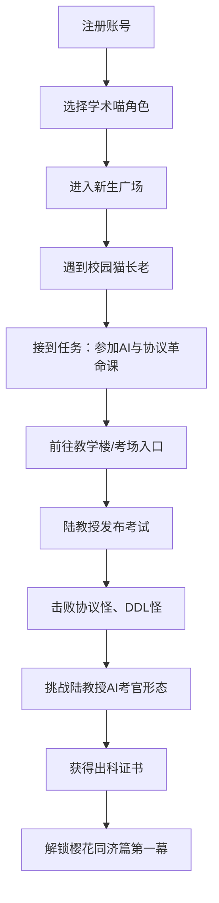
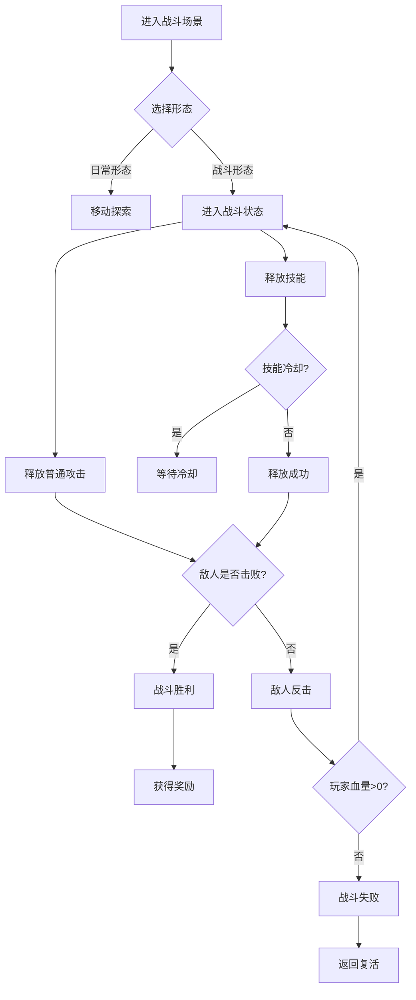

# 《学术喵的奇幻之旅》项目PRD文档

## 1. 产品概述

《学术喵的奇幻之旅》是一款以校园守护为主线的2D网页角色扮演游戏，玩家将化身可爱的猫咪角色，在同济大学风格的校园世界中展开冒险，通过战斗、探索、对话等方式守护校园和平。游戏融合了放置休闲与动作战斗元素，打造轻松有趣的校园奇幻体验。

**目标用户**：校园学生群体、二次元游戏爱好者、休闲游戏玩家

**市场价值**：将校园文化与游戏玩法结合，创造沉浸式的校园奇幻体验，满足年轻用户对轻松娱乐和社交互动的需求。

---

## 2. 核心功能

### 2.1 用户角色

| 角色 | 注册方式 | 核心权限 |
|------|----------|----------|
| 玩家用户 | 手机号/邮箱注册 | 创建角色、游戏探索、战斗、社交 |
| 管理员 | 后台配置 | 游戏数据管理、活动配置、内容审核 |

### 2.2 功能模块

1. **用户注册与登录系统**：账号注册、登录认证、密码找回
2. **角色创建与管理系统**：角色选择、属性管理、装备系统
3. **广场地图场景系统**：主广场场景、社交互动、功能入口
4. **校园探索场景系统**：多区域探索、地图导航、隐藏要素
5. **角色形态切换系统**：日常形态/战斗形态切换
6. **动作战斗系统**：技能释放、连击系统、Boss战
7. **任务成长系统**：主线任务、支线任务、成就系统
8. **放置休息系统**：离线收益、猫咪休息、资源积累
9. **NPC对话系统**：剧情对话、分支选择、好感度系统
10. **通关奖励系统**：关卡奖励、成就奖励、活动奖励

### 2.3 页面详情

| 页面名称 | 模块名称 | 功能描述 |
|----------|----------|----------|
| 登录页面 | 登录模块 | 用户账号密码登录、验证码登录、第三方登录入口 |
| 注册页面 | 注册模块 | 手机号/邮箱注册、验证码验证、密码设置 |
| 角色创建页面 | 角色选择模块 | 5位猫咪角色选择（莉娜、阿宇、知夏、江寻、老登）、职业选择（学霸、学渣、卷王、课代表） |
| 广场地图页面 | 广场场景模块 | 校园广场主场景、NPC交互、功能入口、玩家展示 |
| 探索地图页面 | 探索场景模块 | 校园区域探索、地图导航、战斗触发、资源采集 |
| 战斗页面 | 战斗系统模块 | 实时战斗界面、技能释放、形态切换、战斗结算 |
| 任务页面 | 任务系统模块 | 主线/支线任务列表、任务追踪、奖励领取 |
| 角色详情页面 | 角色管理模块 | 属性查看、装备管理、技能配置、形态预览 |
| 休息页面 | 放置系统模块 | 猫咪休息动画、离线收益领取、资源积累 |
| 对话页面 | NPC对话模块 | 剧情对话、分支选择、选项影响、好感度显示 |
| 奖励页面 | 奖励系统模块 | 通关奖励、成就奖励、活动奖励、邮件领取 |

---

## 3. 核心流程

### 3.1 新手引导流程

### 3.2 战斗流程

### 3.3 章节流程

| 章节 | 名称 | 核心内容 |
|------|------|----------|
| 序章 | 出科考试 | 新生入学、陆教授考核、通过后正式出科 |
| 第一幕 | 樱花校霸事件 | 驱赶骚扰者、维护校园秩序、守护樱花大道 |
| 第二幕 | 医学院危机 | 实验楼异变、生化怪出现、挑战大Boss |
| 第三幕 | 人工智能危机 | 失控机器人、机器狗、无人机来袭、恢复校园平静 |

---

## 4. 用户界面设计

### 4.1 设计风格

- **主色调**：樱花粉(#FFB7C5)、校园蓝(#4A90D9)、学术紫(#9B59B6)
- **辅助色**：活力橙(#FF8C42)、治愈绿(#5CD85C)、警戒红(#E74C3C)
- **按钮风格**：圆润圆角(8px)、渐变填充、悬停缩放效果
- **字体**：思源黑体、游戏专用像素字体
- **布局风格**：卡片式布局、层级分明、视觉引导清晰
- **图标风格**：可爱猫咪主题、扁平化设计、动态效果

### 4.2 页面设计概览

| 页面名称 | 模块名称 | UI元素 |
|----------|----------|--------|
| 登录页面 | 登录模块 | 樱花背景动画、猫咪Logo、登录表单、社交登录按钮 |
| 广场地图 | 广场场景 | 校园建筑背景、NPC角色、功能图标、玩家信息栏 |
| 探索地图 | 探索场景 | 区域地图、可交互点标记、角色移动、战斗触发提示 |
| 战斗页面 | 战斗界面 | 角色立绘、技能按钮、血条、能量条、战斗日志 |
| 角色详情 | 角色面板 | 角色形象、属性数值、装备槽、技能列表 |

### 4.3 响应式设计

- **桌面端**(>1200px)：完整功能展示，多栏布局
- **平板端**(768-1199px)：自适应布局，核心功能保留
- **移动端**(<768px)：简化界面，触控优化，竖屏适配

---

## 5. 角色设定

### 5.1 角色列表

| 角色名称 | 猫形态 | 人设 | 战斗定位 | 属性倾向 |
|----------|--------|------|----------|----------|
| 莉娜 | 白色长毛猫 | 温柔治愈型学术喵/校园风二次元魔法士 | 辅助、治疗、控场 | 智慧、治愈、守护 |
| 阿宇 | 狸花猫 | 勇敢均衡型学术喵/校园风二次元剑道士 | 近战、输出、机动 | 勇气、平衡、担当 |
| 知夏 | 布偶猫 | 睿智学术型魔法喵/校园风学术魔法师 | 远程、法术、爆发 | 睿智、探索、智慧 |
| 江寻 | 虎斑猫(丛林型) | 灵活善型战斗喵/校园风格猎手 | 远程、物理、大范围 | 敏捷、自由、探索 |
| 老登 | 蓝猫 | 强力近战型力量喵/校园风格斗家 | 近战、坦克、控制 | 力量、坚韧、冲锋 |

### 5.2 职业体系

| 职业 | 核心特点 | 技能特色 |
|------|----------|----------|
| 学霸 | 稳定法术输出 | 公式光束、远程压制 |
| 学渣 | 逆袭坦克 | 错题护盾、残血爆发 |
| 卷王 | 高速连击 | DDL冲锋、经验加成 |
| 课代表 | 辅助治疗 | 点名鼓舞、团队增益 |

---

## 6. 游戏经济系统

### 6.1 资源类型

| 资源名称 | 获取方式 | 用途 |
|----------|----------|------|
| 喵币 | 任务奖励、战斗掉落、放置收益 | 购买道具、装备强化 |
| 经验值 | 战斗胜利、任务完成、探索发现 | 角色升级 |
| 喵粮 | 放置休息、签到奖励 | 角色恢复、形态切换 |
| 技能书 | Boss掉落、成就奖励 | 技能学习与升级 |
| 装备 | 关卡掉落、商店购买 | 属性提升 |

### 6.2 消耗规则

- 战斗消耗：喵粮、能量
- 形态切换：喵粮
- 技能释放：能量
- 装备强化：喵币

---

## 7. 技术需求

### 7.1 技术栈

| 层级 | 技术 | 版本 |
|------|------|------|
| 前端框架 | React | 18+ |
| 游戏引擎 | Phaser | 3+ |
| 前端交互 | jQuery | 3+ |
| UI样式 | TailwindCSS | 3+ |
| 后端框架 | Django | 5+ |
| API框架 | FastAPI | 0.100+ |
| 实时通信 | WebSocket | - |
| 数据库 | MySQL | 8+ |
| 缓存 | Redis | 7+ |

### 7.2 性能要求

- 游戏场景加载时间 < 3秒
- 战斗帧率稳定 60fps
- 支持1000+并发玩家在线
- 移动端页面响应时间 < 1秒

---

## 8. 运营需求

### 8.1 活动系统

- 每日签到奖励
- 限时活动副本
- 节日主题活动
- 排行榜系统

### 8.2 社交系统

- 好友系统
- 组队功能
- 聊天系统
- 公会系统(后期扩展)

### 8.3 数据统计

- 用户活跃度统计
- 留存率分析
- 付费转化率分析
- 游戏行为分析

---

## 9. 里程碑规划

| 阶段 | 时间 | 目标 |
|------|------|------|
| 第一阶段 | 第1周 | 完成序章主线流程，实现完整新手闭环 |
| 第二阶段 | 第2-3周 | 完成第一幕樱花校霸事件，开放广场和教学楼区域 |
| 第三阶段 | 第4-5周 | 完成第二幕医学院危机，完善战斗系统 |
| 第四阶段 | 第6-7周 | 完成第三幕人工智能危机，开放全部地图区域 |
| 第五阶段 | 第8周 | 优化体验，上线运营 |

---

## 10. 风险与应对

| 风险类型 | 风险描述 | 应对策略 |
|----------|----------|----------|
| 技术风险 | WebSocket连接不稳定 | 实现重连机制、消息队列 |
| 性能风险 | 游戏资源加载慢 | 资源预加载、CDN加速 |
| 运营风险 | 用户留存率低 | 完善新手引导、丰富活动内容 |
| 安全风险 | 账号被盗、作弊 | 加强认证、反作弊系统 |

---

**文档版本**：v1.0  
**创建日期**：2026-06-29  
**适用范围**：《学术喵的奇幻之旅》项目开发团队