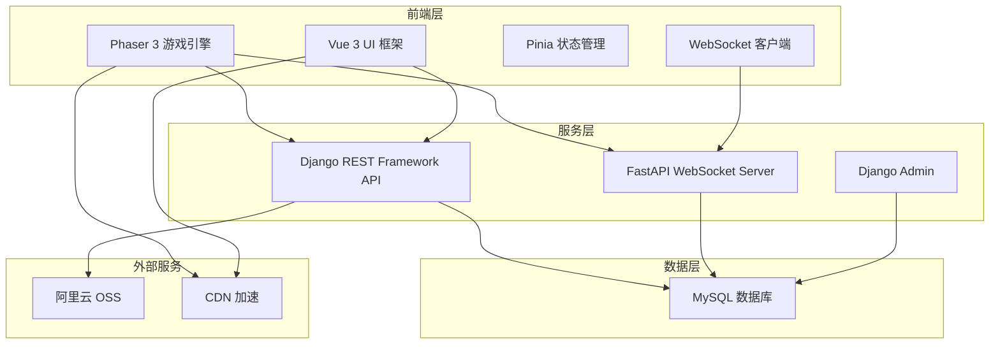
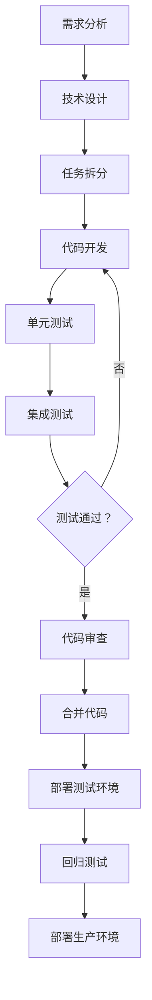
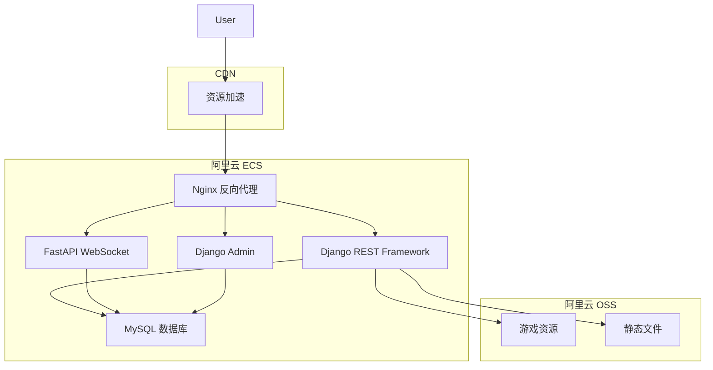

# 《学术喵的奇幻之旅》技术架构文档

## 1. 架构设计

### 1.1 整体架构图



### 1.2 分层架构说明

| 层级 | 职责 | 技术选型 |
|------|------|----------|
| 表现层 | 游戏渲染、UI 展示、用户交互 | Vue 3 + Phaser 3 + TailwindCSS + Pinia |
| 接入层 | HTTP API、WebSocket 实时通信 | Django REST Framework + FastAPI WebSocket |
| 业务层 | 游戏逻辑、业务规则处理 | Django + Python |
| 数据层 | 数据持久化 | MySQL |
| 资源层 | 静态资源、文件存储 | 阿里云 OSS + CDN |

---

## 2. 技术描述

### 2.1 技术栈总览

| 分类 | 技术 | 版本 | 用途 |
|------|------|------|------|
| 游戏引擎 | Phaser | 3.80+ | 2D 游戏渲染、场景管理、物理引擎 |
| 前端框架 | Vue | 3.4+ | UI 界面构建、组件化开发 |
| 状态管理 | Pinia | 2.1+ | 全局状态管理 |
| 路由管理 | Vue Router | 4.2+ | 页面路由 |
| 样式框架 | TailwindCSS | 3.4+ | 快速样式开发 |
| HTTP 客户端 | Axios | 1.6+ | API 请求 |
| 后端框架 | Django | 5.0+ | 管理后台、ORM、权限、REST API |
| API 框架 | Django REST Framework | 3.14+ | RESTful API |
| WebSocket 框架 | FastAPI | 0.110+ | WebSocket 实时通信 |
| 数据库 | MySQL | 8.0+ | 数据持久化 |
| 认证 | JWT | - | 用户认证 |
| 部署 | Nginx | 1.24+ | 反向代理、负载均衡 |
| 容器 | Docker | 24+ | 应用容器化 |

---

## 3. 项目目录结构

```
campus-daze/
├── backend/                    # 后端代码
│   ├── core/                   # Django 项目配置
│   │   ├── settings/           # 配置文件
│   │   │   └── base.py         # 基础配置
│   │   ├── urls.py             # 主路由配置
│   │   ├── wsgi.py             # WSGI 配置
│   │   └── asgi.py             # ASGI 配置
│   ├── modules/                # 业务模块（Django Apps）
│   │   ├── users/              # 用户模块
│   │   │   ├── models.py       # 用户模型（User, Role, Permission）
│   │   │   ├── views.py        # 视图
│   │   │   ├── serializers.py  # 序列化器
│   │   │   └── urls.py         # 路由
│   │   ├── characters/         # 角色模块
│   │   │   ├── models.py       # 角色模型（Character, Equipment, Skill）
│   │   │   ├── views.py
│   │   │   ├── serializers.py
│   │   │   └── urls.py
│   │   ├── maps/               # 地图模块
│   │   │   ├── models.py       # 地图模型（Area, MapTile, MapObject）
│   │   │   ├── views.py
│   │   │   ├── serializers.py
│   │   │   └── urls.py
│   │   ├── chapters/           # 章节模块
│   │   │   ├── models.py       # 章节模型（Chapter, Scene, ChapterProgress）
│   │   │   ├── views.py
│   │   │   ├── serializers.py
│   │   │   └── urls.py
│   │   ├── gameplay/           # 游戏玩法模块
│   │   │   ├── models.py       # 玩法模型（Battle, Task, Reward, RestRecord）
│   │   │   ├── views.py
│   │   │   ├── serializers.py
│   │   │   └── urls.py
│   │   ├── dialogue/           # 对话模块
│   │   │   ├── models.py       # 对话模型（NPC, Dialogue, NPCAffinity）
│   │   │   ├── views.py
│   │   │   ├── serializers.py
│   │   │   └── urls.py
│   │   ├── stages/             # 关卡模块
│   │   │   ├── models.py       # 关卡模型（Stage, Enemy, StageProgress）
│   │   │   ├── views.py
│   │   │   ├── serializers.py
│   │   │   └── urls.py
│   │   └── saves/              # 存档模块
│   │       ├── models.py       # 存档模型（SaveSlot, SaveData）
│   │       ├── views.py
│   │       ├── serializers.py
│   │       └── urls.py
│   ├── common/                 # 公共工具模块
│   │   ├── auth/               # 认证工具
│   │   │   └── jwt_handler.py  # JWT 处理
│   │   └── database/           # 数据库工具
│   │       └── fallback.py     # 降级处理
│   ├── api/                    # FastAPI 应用（WebSocket）
│   │   ├── main.py             # FastAPI 入口
│   │   ├── config.py           # 配置
│   │   └── routers/            # WebSocket 路由
│   │       ├── battle_ws.py    # 战斗 WebSocket
│   │       └── chat_ws.py      # 聊天 WebSocket
│   ├── manage.py               # Django 管理脚本
│   └── requirements/           # 依赖配置
│       └── base.txt            # Python 依赖
├── frontend/                   # 前端代码
│   ├── src/
│   │   ├── modules/            # 业务模块（按功能组织）
│   │   │   ├── users/          # 用户模块
│   │   │   │   └── views/      # 页面组件
│   │   │   │       ├── LoginPage.vue
│   │   │   │       ├── RegisterPage.vue
│   │   │   │       └── UserCenter.vue
│   │   │   ├── characters/     # 角色模块
│   │   │   │   └── views/
│   │   │   │       └── CreateCharacter.vue
│   │   │   ├── maps/           # 地图模块
│   │   │   │   └── views/
│   │   │   │       ├── MapPage.vue
│   │   │   │       └── ExplorePage.vue
│   │   │   ├── gameplay/       # 游戏玩法模块
│   │   │   │   └── views/
│   │   │   │       ├── BattlePage.vue
│   │   │   │       ├── TasksPage.vue
│   │   │   │       ├── RewardsPage.vue
│   │   │   │       └── RestPage.vue
│   │   │   ├── dialogue/       # 对话模块
│   │   │   │   └── views/
│   │   │   │       └── DialoguePage.vue
│   │   │   ├── chapters/       # 章节模块
│   │   │   │   └── views/
│   │   │   │       └── ChaptersPage.vue
│   │   │   ├── stages/         # 关卡模块
│   │   │   │   └── views/
│   │   │   │       └── StagesPage.vue
│   │   │   └── saves/          # 存档模块
│   │   │       └── views/
│   │   │           └── SavesPage.vue
│   │   ├── stores/             # Pinia 状态管理
│   │   │   ├── user.js         # 用户状态
│   │   │   ├── character.js    # 角色状态
│   │   │   └── game.js         # 游戏状态
│   │   ├── api/                # API 客户端
│   │   │   └── index.js        # Axios 配置
│   │   ├── router/             # 路由配置
│   │   │   └── index.js        # Vue Router 配置
│   │   ├── assets/             # 静态资源
│   │   │   ├── sprites/        # 精灵图
│   │   │   ├── tiles/          # 地图瓦片
│   │   │   └── sounds/         # 音效
│   │   ├── App.vue             # 根组件
│   │   └── main.js             # 入口文件
│   ├── public/                 # 公共资源
│   ├── package.json            # 前端依赖
│   ├── vite.config.js          # Vite 配置
│   └── tailwind.config.js      # Tailwind 配置
├── deploy/                     # 部署配置
│   ├── deploy.sh               # 部署脚本
│   ├── nginx.conf              # Nginx 配置
│   ├── supervisord.conf        # 进程管理
│   ├── start.bat               # Windows 启动脚本
│   └── stop.bat                # Windows 停止脚本
└── doc/                        # 文档目录
    ├── PRD.md                  # 产品需求文档
    └── TECHNICAL_ARCHITECTURE.md # 技术架构文档
```

---

## 4. 路由定义

### 4.1 前端路由

| 路由 | 组件 | 功能 | 权限 |
|------|------|------|------|
| / | LoginPage | 登录页面（重定向） | 匿名 |
| /login | LoginPage | 登录页面 | 匿名 |
| /register | RegisterPage | 注册页面 | 匿名 |
| /user-center | UserCenter | 用户中心 | 已登录 |
| /create-character | CreateCharacter | 角色创建 | 已登录 |
| /plaza | MapPage | 广场地图 | 已登录 |
| /explore | ExplorePage | 探索地图 | 已登录 |
| /battle | BattlePage | 战斗页面 | 已登录 |
| /tasks | TasksPage | 任务列表 | 已登录 |
| /rewards | RewardsPage | 奖励页面 | 已登录 |
| /rest | RestPage | 放置休息 | 已登录 |
| /dialogue/:npcId | DialoguePage | NPC 对话 | 已登录 |
| /chapters | ChaptersPage | 章节列表 | 已登录 |
| /stages | StagesPage | 关卡列表 | 已登录 |
| /saves | SavesPage | 存档管理 | 已登录 |

### 4.2 后端 API 路由

| 路由前缀 | 模块 | 功能 |
|----------|------|------|
| /api/auth/ | 用户模块 | 登录、注册、刷新 Token、获取用户信息 |
| /api/characters/ | 角色模块 | 角色创建、属性、装备、技能 |
| /api/maps/ | 地图模块 | 区域信息、地图瓦片、地图对象 |
| /api/chapters/ | 章节模块 | 章节列表、场景、进度 |
| /api/gameplay/ | 游戏玩法模块 | 战斗、任务、奖励、休息 |
| /api/dialogue/ | 对话模块 | NPC 对话、好感度 |
| /api/stages/ | 关卡模块 | 关卡列表、敌人、进度 |
| /api/saves/ | 存档模块 | 存档槽、存档数据 |

---

## 5. API 接口规范

### 5.1 认证接口

| 接口 | 方法 | 路径 | 请求体 | 响应体 |
|------|------|------|--------|--------|
| 用户注册 | POST | /api/auth/register | `{username, email, password}` | `{token, user}` |
| 用户登录 | POST | /api/auth/login | `{username, password}` | `{token, user}` |
| Token 刷新 | POST | /api/auth/refresh | `{refresh_token}` | `{access_token}` |
| 获取当前用户 | GET | /api/auth/me | - | `{user}` |

### 5.2 角色接口

| 接口 | 方法 | 路径 | 请求体 | 响应体 |
|------|------|------|--------|--------|
| 创建角色 | POST | /api/characters | `{name, template_id, profession_id}` | `{character}` |
| 获取角色列表 | GET | /api/characters | - | `[{character}]` |
| 获取角色详情 | GET | /api/characters/{id} | - | `{character}` |
| 更新角色属性 | PUT | /api/characters/{id} | `{level, exp, hp, mp}` | `{character}` |
| 装备管理 | PUT | /api/characters/{id}/equipment | `{slot, equipment_id}` | `{character}` |
| 形态切换 | POST | /api/characters/{id}/transform | `{form_type}` | `{character}` |

### 5.3 战斗接口

| 接口 | 方法 | 路径 | 请求体 | 响应体 |
|------|------|------|--------|--------|
| 开始战斗 | POST | /api/gameplay/battle/start | `{enemy_id, character_id}` | `{battle_id, state}` |
| 释放技能 | POST | /api/gameplay/battle/{id}/skill | `{skill_id}` | `{damage, cooldown}` |
| 普通攻击 | POST | /api/gameplay/battle/{id}/attack | - | `{damage}` |
| 战斗结算 | GET | /api/gameplay/battle/{id}/result | - | `{result, rewards}` |

### 5.4 任务接口

| 接口 | 方法 | 路径 | 请求体 | 响应体 |
|------|------|------|--------|--------|
| 获取任务列表 | GET | /api/gameplay/tasks | `{type}` | `[{task}]` |
| 获取任务详情 | GET | /api/gameplay/tasks/{id} | - | `{task}` |
| 接受任务 | POST | /api/gameplay/tasks/{id}/accept | - | `{task}` |
| 更新任务进度 | PUT | /api/gameplay/tasks/{id}/progress | `{progress}` | `{task}` |
| 完成任务 | POST | /api/gameplay/tasks/{id}/complete | - | `{rewards}` |

### 5.5 地图接口

| 接口 | 方法 | 路径 | 请求体 | 响应体 |
|------|------|------|--------|--------|
| 获取区域列表 | GET | /api/maps/areas | - | `[{area}]` |
| 获取区域详情 | GET | /api/maps/areas/{id} | - | `{area, npcs, enemies}` |
| 探索区域 | POST | /api/maps/areas/{id}/explore | - | `{discovery, rewards}` |

### 5.6 NPC 接口

| 接口 | 方法 | 路径 | 请求体 | 响应体 |
|------|------|------|--------|--------|
| 获取 NPC 列表 | GET | /api/dialogue/npcs | - | `[{npc}]` |
| 获取对话 | GET | /api/dialogue/npcs/{id}/dialogue | - | `{dialogue}` |
| 发送对话选择 | POST | /api/dialogue/npcs/{id}/respond | `{choice_id}` | `{next_dialogue, affinity}` |

### 5.7 奖励接口

| 接口 | 方法 | 路径 | 请求体 | 响应体 |
|------|------|------|--------|--------|
| 获取奖励列表 | GET | /api/gameplay/rewards | - | `[{reward}]` |
| 领取奖励 | POST | /api/gameplay/rewards/{id}/claim | - | `{rewards}` |
| 获取成就列表 | GET | /api/gameplay/achievements | - | `[{achievement}]` |

### 5.8 休息接口

| 接口 | 方法 | 路径 | 请求体 | 响应体 |
|------|------|------|--------|--------|
| 开始休息 | POST | /api/gameplay/rest/start | - | `{start_time}` |
| 结束休息 | POST | /api/gameplay/rest/end | - | `{rewards}` |
| 获取离线收益 | GET | /api/gameplay/rest/offline | - | `{offline_rewards}` |

---

## 6. WebSocket 通信协议

### 6.1 消息格式

```json
{
    "type": "string",
    "data": {},
    "timestamp": "number",
    "user_id": "string"
}
```

### 6.2 战斗消息类型

| 消息类型 | 方向 | 数据结构 | 说明 |
|----------|------|----------|------|
| BATTLE_START | 服务端→客户端 | `{battle_id, enemy, character}` | 战斗开始 |
| PLAYER_ATTACK | 客户端→服务端 | `{battle_id}` | 普通攻击 |
| PLAYER_SKILL | 客户端→服务端 | `{battle_id, skill_id}` | 技能释放 |
| DAMAGE_DEALT | 服务端→客户端 | `{target_id, damage, hp_left}` | 伤害结算 |
| ENEMY_TURN | 服务端→客户端 | `{enemy_action, damage}` | 敌方行动 |
| BATTLE_END | 服务端→客户端 | `{result, rewards}` | 战斗结束 |
| FORM_CHANGE | 客户端→服务端 | `{battle_id, form_type}` | 形态切换 |

### 6.3 聊天消息类型

| 消息类型 | 方向 | 数据结构 | 说明 |
|----------|------|----------|------|
| CHAT_MESSAGE | 双向 | `{channel, message, sender}` | 聊天消息 |
| ONLINE_USERS | 服务端→客户端 | `{users}` | 在线用户列表 |
| USER_JOIN | 服务端→客户端 | `{user}` | 用户上线 |
| USER_LEAVE | 服务端→客户端 | `{user_id}` | 用户下线 |

---

## 7. 数据库模型设计

### 7.1 数据库 ER 图

```mermaid
erDiagram
    USER ||--o{ CHARACTER : has
    USER ||--o{ SAVE_SLOT : has
    USER ||--o{ STAGE_PROGRESS : tracks
    USER ||--o{ CHAPTER_PROGRESS : tracks
    USER ||--o{ NPC_AFFINITY : has
    
    CHARACTER ||--o{ EQUIPMENT : wears
    CHARACTER ||--o{ SKILL : learns
    CHARACTER ||--o{ TASK_PROGRESS : completes
    CHARACTER ||--o{ REST_RECORD : rests
    CHARACTER ||--o{ BATTLE : participates
    CHARACTER ||--o{ CHARACTER_ACHIEVEMENT : unlocks
    
    AREA ||--o{ NPC : contains
    AREA ||--o{ ENEMY : contains
    AREA ||--o{ MAP_TILE : has
    AREA ||--o{ MAP_OBJECT : has
    
    CHAPTER ||--o{ SCENE : has
    CHAPTER ||--o{ CHAPTER_PROGRESS : tracks
    CHAPTER ||--o{ STAGE : has
    
    STAGE ||--o{ STAGE_PROGRESS : tracks
    
    TASK ||--o{ TASK_PROGRESS : tracks
    
    NPC ||--o{ DIALOGUE : has
    NPC ||--o{ NPC_AFFINITY : has
    
    SAVE_SLOT ||--o{ SAVE_DATA : contains
    
    USER {
        bigint id PK
        varchar username UK
        varchar email
        int role_id FK
        boolean is_active
        boolean is_staff
        boolean is_superuser
        datetime created_at
        datetime updated_at
    }
    
    ROLE {
        int id PK
        varchar name UK
        text description
    }
    
    PERMISSION {
        int id PK
        varchar codename UK
        varchar name
        varchar module
    }
    
    CHARACTER {
        bigint id PK
        bigint user_id FK
        varchar name
        int template_id FK
        int profession_id FK
        int level
        int exp
        int hp
        int max_hp
        int mp
        int max_mp
        int attack
        int defense
        int agility
        int intelligence
        int current_form
        datetime created_at
        datetime updated_at
    }
    
    CHARACTER_TEMPLATE {
        int id PK
        varchar name
        varchar cat_type
        varchar personality
        varchar battle_role
        int base_hp
        int base_attack
        int base_defense
        int base_agility
        int base_intelligence
        varchar sprite_url
    }
    
    PROFESSION {
        int id PK
        varchar name
        text description
        varchar skill_bonus
    }
    
    EQUIPMENT {
        bigint id PK
        bigint character_id FK
        int template_id FK
        int level
    }
    
    EQUIPMENT_TEMPLATE {
        int id PK
        varchar name
        int slot
        int rarity
        int attack_bonus
        int defense_bonus
        int hp_bonus
        int mp_bonus
    }
    
    SKILL {
        bigint id PK
        bigint character_id FK
        int template_id FK
        int level
        int cooldown_remaining
    }
    
    SKILL_TEMPLATE {
        int id PK
        varchar name
        text description
        int damage
        int mp_cost
        int cooldown
        int range
        varchar skill_type
    }
    
    AREA {
        int id PK
        varchar name
        text description
        boolean unlocked
        int exploration_percent
        varchar map_url
        int order
        datetime created_at
        datetime updated_at
    }
    
    MAP_TILE {
        int id PK
        int area_id FK
        int x
        int y
        varchar tile_type
        boolean walkable
        int event_id
    }
    
    MAP_OBJECT {
        int id PK
        int area_id FK
        varchar name
        varchar object_type
        int x
        int y
        varchar sprite_url
        boolean interactable
    }
    
    NPC {
        int id PK
        varchar name
        int area_id FK
        varchar avatar_url
        int affinity
        int dialogues_completed
        datetime created_at
        datetime updated_at
    }
    
    DIALOGUE {
        int id PK
        int npc_id FK
        int order
        text text
        json choices
        int next_dialogue_id
        int reward_id
    }
    
    DIALOGUE_CHOICE {
        int id PK
        int dialogue_id FK
        varchar choice_text
        int next_dialogue_id
        int affinity_change
    }
    
    NPC_AFFINITY {
        int id PK
        bigint user_id FK
        int npc_id FK
        int affinity
        int dialogues_completed
        datetime last_interaction
    }
    
    ENEMY {
        int id PK
        varchar name
        int area_id FK
        int level
        int hp
        int max_hp
        int attack
        int defense
        int exp_reward
        int coin_reward
        boolean is_boss
        varchar sprite_url
        datetime created_at
        datetime updated_at
    }
    
    CHAPTER {
        int id PK
        varchar name
        text description
        int order UK
        int required_level
        boolean unlocked
        datetime created_at
    }
    
    SCENE {
        int id PK
        int chapter_id FK
        varchar name
        text description
        int order
        int dialogue_id
        varchar background_url
    }
    
    CHAPTER_PROGRESS {
        int id PK
        bigint user_id FK
        int chapter_id FK
        int current_scene_id FK
        boolean completed
        datetime completed_at
    }
    
    STAGE {
        int id PK
        varchar name
        text description
        int chapter_id FK
        int order
        int required_level
        json enemy_ids
        int boss_id
        int reward_id
    }
    
    STAGE_PROGRESS {
        int id PK
        bigint user_id FK
        int stage_id FK
        boolean completed
        int best_score
        int attempts
        datetime completed_at
    }
    
    TASK {
        bigint id PK
        varchar name
        text description
        int type
        int difficulty
        int order
        int required_level
        json objectives
        int reward_id
        int next_task_id
    }
    
    TASK_PROGRESS {
        bigint id PK
        bigint character_id FK
        bigint task_id FK
        int progress
        int status
        datetime completed_at
    }
    
    BATTLE {
        bigint id PK
        bigint character_id FK
        int enemy_id
        int result
        int turn_count
        datetime start_time
        datetime end_time
    }
    
    REST_RECORD {
        bigint id PK
        bigint character_id FK
        datetime start_time
        datetime end_time
        int coins_earned
        int exp_earned
        int cat_food_earned
    }
    
    REWARD {
        bigint id PK
        varchar name
        int coin_amount
        int exp_amount
        int cat_food_amount
        int skill_book_id
        int equipment_id
    }
    
    ACHIEVEMENT {
        bigint id PK
        varchar name
        text description
        varchar condition_type
        int condition_value
        int reward_id
        int order
    }
    
    CHARACTER_ACHIEVEMENT {
        bigint character_id FK
        bigint achievement_id FK
        int progress
        boolean unlocked
        datetime unlocked_at
    }
    
    SAVE_SLOT {
        int id PK
        bigint user_id FK
        varchar name
        int slot_number
        datetime created_at
        datetime updated_at
    }
    
    SAVE_DATA {
        int id PK
        int save_slot_id FK
        varchar data_key
        json data_value
        datetime saved_at
    }
```



### 7.2 核心表结构

#### 用户表（users_user）
| 字段 | 类型 | 约束 | 说明 |
|------|------|------|------|
| id | BIGINT | PK, AUTO_INCREMENT | 用户 ID |
| username | VARCHAR(50) | UNIQUE, NOT NULL | 用户名 |
| email | VARCHAR(254) | NULL | 邮箱 |
| role_id | INT | FK | 角色 ID |
| is_active | BOOLEAN | DEFAULT TRUE | 是否激活 |
| is_staff | BOOLEAN | DEFAULT FALSE | 是否员工 |
| is_superuser | BOOLEAN | DEFAULT FALSE | 是否超级管理员 |
| created_at | DATETIME | NOT NULL | 创建时间 |
| updated_at | DATETIME | NOT NULL | 更新时间 |

#### 角色表（characters_character）
| 字段 | 类型 | 约束 | 说明 |
|------|------|------|------|
| id | BIGINT | PK, AUTO_INCREMENT | 角色 ID |
| user_id | BIGINT | FK | 用户 ID |
| name | VARCHAR(50) | NOT NULL | 角色名称 |
| template_id | INT | FK | 角色模板 ID |
| profession_id | INT | FK | 职业 ID |
| level | INT | DEFAULT 1 | 等级 |
| exp | INT | DEFAULT 0 | 经验值 |
| hp | INT | DEFAULT 100 | 当前血量 |
| max_hp | INT | DEFAULT 100 | 最大血量 |
| mp | INT | DEFAULT 50 | 当前魔法值 |
| max_mp | INT | DEFAULT 50 | 最大魔法值 |
| attack | INT | DEFAULT 10 | 攻击力 |
| defense | INT | DEFAULT 5 | 防御力 |
| agility | INT | DEFAULT 5 | 敏捷度 |
| intelligence | INT | DEFAULT 5 | 智力 |
| current_form | INT | DEFAULT 0 | 当前形态（0=日常，1=战斗） |
| created_at | DATETIME | NOT NULL | 创建时间 |
| updated_at | DATETIME | NOT NULL | 更新时间 |

#### 角色模板表（characters_charactertemplate）
| 字段 | 类型 | 约束 | 说明 |
|------|------|------|------|
| id | INT | PK, AUTO_INCREMENT | 模板 ID |
| name | VARCHAR(50) | NOT NULL | 角色名称 |
| cat_type | VARCHAR(50) | NOT NULL | 猫咪类型 |
| personality | VARCHAR(100) | NOT NULL | 人设描述 |
| battle_role | VARCHAR(50) | NOT NULL | 战斗定位 |
| base_hp | INT | DEFAULT 100 | 基础血量 |
| base_attack | INT | DEFAULT 10 | 基础攻击 |
| base_defense | INT | DEFAULT 5 | 基础防御 |
| base_agility | INT | DEFAULT 5 | 基础敏捷 |
| base_intelligence | INT | DEFAULT 5 | 基础智力 |
| sprite_url | VARCHAR(255) | NOT NULL | 精灵图路径 |

#### 职业表（characters_profession）
| 字段 | 类型 | 约束 | 说明 |
|------|------|------|------|
| id | INT | PK, AUTO_INCREMENT | 职业 ID |
| name | VARCHAR(50) | NOT NULL | 职业名称 |
| description | TEXT | NULL | 职业描述 |
| skill_bonus | VARCHAR(100) | NULL | 技能加成 |

#### 区域表（maps_area）
| 字段 | 类型 | 约束 | 说明 |
|------|------|------|------|
| id | INT | PK, AUTO_INCREMENT | 区域 ID |
| name | VARCHAR(50) | NOT NULL | 区域名称 |
| description | TEXT | NULL | 区域描述 |
| unlocked | BOOLEAN | DEFAULT FALSE | 是否已解锁 |
| exploration_percent | INT | DEFAULT 0 | 探索进度 |
| map_url | VARCHAR(255) | NOT NULL | 地图资源路径 |
| order | INT | NOT NULL | 区域顺序 |
| created_at | DATETIME | NOT NULL | 创建时间 |
| updated_at | DATETIME | NOT NULL | 更新时间 |

#### 敌人表（stages_enemy）
| 字段 | 类型 | 约束 | 说明 |
|------|------|------|------|
| id | INT | PK, AUTO_INCREMENT | 敌人 ID |
| name | VARCHAR(100) | NOT NULL | 敌人名称 |
| area_id | INT | FK | 所在区域 |
| level | INT | DEFAULT 1 | 等级 |
| hp | INT | DEFAULT 100 | 血量 |
| max_hp | INT | DEFAULT 100 | 最大血量 |
| attack | INT | DEFAULT 10 | 攻击力 |
| defense | INT | DEFAULT 5 | 防御力 |
| exp_reward | INT | DEFAULT 50 | 经验奖励 |
| coin_reward | INT | DEFAULT 20 | 金币奖励 |
| is_boss | BOOLEAN | DEFAULT FALSE | 是否 Boss |
| sprite_url | VARCHAR(255) | NOT NULL | 精灵图路径 |
| created_at | DATETIME | NOT NULL | 创建时间 |
| updated_at | DATETIME | NOT NULL | 更新时间 |

#### 任务表（gameplay_task）
| 字段 | 类型 | 约束 | 说明 |
|------|------|------|------|
| id | BIGINT | PK, AUTO_INCREMENT | 任务 ID |
| name | VARCHAR(100) | NOT NULL | 任务名称 |
| description | TEXT | NOT NULL | 任务描述 |
| type | INT | NOT NULL | 任务类型（1=主线，2=支线） |
| difficulty | INT | DEFAULT 1 | 难度等级 |
| order | INT | NOT NULL | 任务顺序 |
| required_level | INT | DEFAULT 1 | 要求等级 |
| objectives | JSON | NOT NULL | 任务目标 |
| reward_id | BIGINT | FK | 奖励 ID |
| next_task_id | BIGINT | FK | 下一个任务 |

---

## 8. 游戏资源管理方案

### 8.1 资源分类

| 资源类型 | 目录 | 格式 | 说明 |
|----------|------|------|------|
| 角色精灵 | assets/sprites/characters/ | PNG | 角色站立、行走、攻击、技能动画 |
| 敌人精灵 | assets/sprites/enemies/ | PNG | 敌人动画帧 |
| NPC 精灵 | assets/sprites/npcs/ | PNG | NPC 角色精灵 |
| 地图瓦片 | assets/tiles/ | PNG | 地图块、场景元素 |
| 特效资源 | assets/effects/ | PNG/GIF | 技能特效、粒子效果 |
| 音效文件 | assets/sounds/ | MP3/WAV | BGM、音效、语音 |
| 配置文件 | assets/config/ | JSON | 游戏配置、角色属性 |

### 8.2 资源加载策略

- **预加载**：游戏启动时加载核心资源（角色精灵、地图瓦片）
- **按需加载**：进入特定场景时加载对应资源
- **缓存机制**：已加载资源本地缓存，减少重复请求
- **CDN 加速**：静态资源通过 CDN 分发，降低延迟

### 8.3 资源版本管理

- 资源文件名包含版本号：`character_lina_v1.png`
- 资源更新时自动清除旧版本缓存
- 支持资源热更新，无需重启游戏

---

## 9. 安全设计

### 9.1 认证安全

- 使用 JWT Token 进行认证，设置合理过期时间
- 密码使用 bcrypt 加密存储
- 支持 Token 刷新机制，避免频繁登录
- 防止 Token 泄露，设置 HttpOnly 和 Secure 标志

### 9.2 数据安全

- 输入验证：所有用户输入进行严格验证
- SQL 注入防护：使用 ORM 参数化查询
- XSS 防护：前端进行 HTML 转义，后端设置 CSP 头
- CSRF 防护：设置 CSRF Token

### 9.3 通信安全

- WebSocket 连接使用 wss 协议
- API 接口使用 HTTPS 协议
- 敏感数据传输进行加密
- 防止重放攻击，添加请求时间戳验证

---

## 10. 开发与部署流程

### 10.1 开发流程



### 10.2 部署架构



### 10.3 环境配置

#### 开发环境
- 操作系统：Windows 10/11
- 数据库：MySQL 8.0 本地

#### 测试环境
- 操作系统：Ubuntu 22.04
- 数据库：MySQL 8.0

#### 生产环境
- 操作系统：Ubuntu 22.04（阿里云 ECS）
- 数据库：阿里云 RDS MySQL
- 对象存储：阿里云 OSS
- CDN：阿里云 CDN

---

## 11. 性能优化方案

### 11.1 前端优化

- 资源压缩：图片、JS、CSS 文件压缩
- 代码分割：按需加载，减少首屏加载时间
- 渲染优化：Phaser 对象池、批量渲染
- 内存管理：及时销毁不再使用的对象

### 11.2 后端优化

- 数据库索引：合理创建索引，优化查询
- 查询优化：使用 Django ORM 的 select_related 和 prefetch_related
- 连接池：数据库连接池管理
- 异步处理：耗时操作异步执行

### 11.3 网络优化

- CDN 加速：静态资源 CDN 分发
- 数据压缩：API 响应数据压缩
- 请求合并：减少 HTTP 请求次数
- WebSocket 心跳：保持连接活跃

---

**文档版本**：v2.0  
**创建日期**：2026-06-30  
**更新日期**：2026-06-30  
**适用范围**：《学术喵的奇幻之旅》项目开发团队
