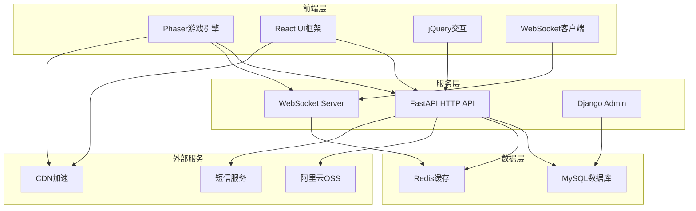
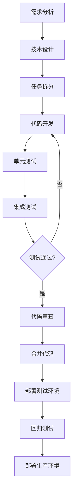
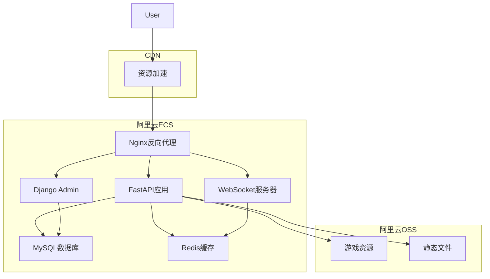

# 《学术喵的奇幻之旅》技术架构文档

## 1. 架构设计

### 1.1 整体架构图



### 1.2 分层架构说明

| 层级 | 职责 | 技术选型 |
|------|------|----------|
| 表现层 | 游戏渲染、UI展示、用户交互 | Phaser 3 + React + jQuery + TailwindCSS |
| 接入层 | HTTP API、WebSocket实时通信 | FastAPI + WebSocket |
| 业务层 | 游戏逻辑、业务规则处理 | FastAPI + Python |
| 数据层 | 数据持久化、缓存 | MySQL + Redis |
| 资源层 | 静态资源、文件存储 | 阿里云OSS + CDN |

---

## 2. 技术描述

### 2.1 技术栈总览

| 分类 | 技术 | 版本 | 用途 |
|------|------|------|------|
| 游戏引擎 | Phaser | 3.80+ | 2D游戏渲染、场景管理、物理引擎 |
| 前端框架 | React | 18+ | UI界面构建、状态管理 |
| 前端交互 | jQuery | 3.7+ | DOM操作、事件处理 |
| 样式框架 | TailwindCSS | 3.4+ | 快速样式开发 |
| 路由管理 | React Router | 6.20+ | 页面路由 |
| 状态管理 | Redux Toolkit | 2.0+ | 全局状态管理 |
| HTTP客户端 | Axios | 1.6+ | API请求 |
| 后端框架 | Django | 5.0+ | 管理后台、ORM、权限 |
| API框架 | FastAPI | 0.110+ | RESTful API、WebSocket |
| 数据库 | MySQL | 8.0+ | 数据持久化 |
| 缓存 | Redis | 7.0+ | 会话缓存、实时数据 |
| 认证 | JWT | - | 用户认证 |
| 部署 | Nginx | 1.24+ | 反向代理、负载均衡 |
| 容器 | Docker | 24+ | 应用容器化 |

---

## 3. 项目目录结构

```
campus-daze/
├── backend/                    # 后端代码
│   ├── api/                    # FastAPI应用
│   │   ├── main.py             # 应用入口
│   │   ├── routers/            # API路由
│   │   │   ├── auth.py         # 认证接口
│   │   │   ├── character.py    # 角色接口
│   │   │   ├── battle.py       # 战斗接口
│   │   │   ├── task.py         # 任务接口
│   │   │   ├── map.py          # 地图接口
│   │   │   ├── npc.py          # NPC接口
│   │   │   └── reward.py       # 奖励接口
│   │   ├── schemas/            # 数据模型
│   │   ├── services/           # 业务逻辑
│   │   ├── websocket/          # WebSocket处理
│   │   │   ├── battle.py       # 战斗实时通信
│   │   │   └── chat.py         # 聊天通信
│   │   └── utils/              # 工具函数
│   ├── django/                 # Django应用
│   │   ├── campus_daze/        # 项目配置
│   │   ├── admin/              # 管理后台
│   │   ├── users/              # 用户管理
│   │   ├── characters/         # 角色数据
│   │   └── tasks/              # 任务管理
│   ├── database/               # 数据库迁移
│   └── requirements.txt        # 后端依赖
├── frontend/                   # 前端代码
│   ├── src/
│   │   ├── components/         # UI组件
│   │   ├── scenes/             # Phaser场景
│   │   │   ├── LoginScene.js   # 登录场景
│   │   │   ├── PlazaScene.js   # 广场场景
│   │   │   ├── ExploreScene.js # 探索场景
│   │   │   └── BattleScene.js  # 战斗场景
│   │   ├── redux/              # Redux状态管理
│   │   ├── services/           # API服务
│   │   ├── assets/             # 游戏资源
│   │   │   ├── sprites/        # 角色精灵
│   │   │   ├── tiles/          # 地图瓦片
│   │   │   └── sounds/         # 音效文件
│   │   └── App.js              # 主应用
│   ├── public/                 # 静态资源
│   └── package.json            # 前端依赖
├── deploy/                     # 部署配置
│   ├── docker-compose.yml      # Docker配置
│   ├── nginx.conf              # Nginx配置
│   └── supervisord.conf        # 进程管理
└── doc/                        # 文档目录
    ├── PRD.md                  # 产品需求文档
    └── TECHNICAL_ARCHITECTURE.md # 技术架构文档
```

---

## 4. 路由定义

### 4.1 前端路由

| 路由 | 组件 | 功能 | 权限 |
|------|------|------|------|
| / | LoginPage | 登录页面 | 匿名 |
| /register | RegisterPage | 注册页面 | 匿名 |
| /create-character | CreateCharacterPage | 角色创建 | 已登录 |
| /plaza | PlazaPage | 广场地图 | 已登录 |
| /explore | ExplorePage | 探索地图 | 已登录 |
| /battle | BattlePage | 战斗页面 | 已登录 |
| /character | CharacterPage | 角色详情 | 已登录 |
| /tasks | TasksPage | 任务列表 | 已登录 |
| /rest | RestPage | 放置休息 | 已登录 |
| /rewards | RewardsPage | 奖励页面 | 已登录 |

### 4.2 后端API路由

| 路由前缀 | 模块 | 功能 |
|----------|------|------|
| /api/auth | 认证模块 | 登录、注册、刷新Token |
| /api/characters | 角色模块 | 角色创建、属性、装备 |
| /api/battle | 战斗模块 | 战斗开始、技能释放、结算 |
| /api/tasks | 任务模块 | 任务列表、进度、奖励 |
| /api/map | 地图模块 | 区域信息、探索进度 |
| /api/npc | NPC模块 | 对话内容、好感度 |
| /api/rewards | 奖励模块 | 奖励领取、成就 |
| /api/rest | 休息模块 | 放置收益、离线奖励 |

---

## 5. API接口规范

### 5.1 认证接口

| 接口 | 方法 | 路径 | 请求体 | 响应体 |
|------|------|------|--------|--------|
| 用户注册 | POST | /api/auth/register | `{username, email, password}` | `{token, user}` |
| 用户登录 | POST | /api/auth/login | `{email, password}` | `{token, user}` |
| Token刷新 | POST | /api/auth/refresh | `{refresh_token}` | `{access_token}` |
| 获取当前用户 | GET | /api/auth/me | - | `{user}` |

### 5.2 角色接口

| 接口 | 方法 | 路径 | 请求体 | 响应体 |
|------|------|------|--------|--------|
| 创建角色 | POST | /api/characters | `{name, character_id, profession}` | `{character}` |
| 获取角色列表 | GET | /api/characters | - | `[{character}]` |
| 获取角色详情 | GET | /api/characters/{id} | - | `{character}` |
| 更新角色属性 | PUT | /api/characters/{id} | `{level, exp, hp, mp}` | `{character}` |
| 装备管理 | PUT | /api/characters/{id}/equipment | `{slot, equipment_id}` | `{character}` |
| 形态切换 | POST | /api/characters/{id}/transform | `{form_type}` | `{character}` |

### 5.3 战斗接口

| 接口 | 方法 | 路径 | 请求体 | 响应体 |
|------|------|------|--------|--------|
| 开始战斗 | POST | /api/battle/start | `{enemy_id, character_id}` | `{battle_id, state}` |
| 释放技能 | POST | /api/battle/{id}/skill | `{skill_id}` | `{damage, cooldown}` |
| 普通攻击 | POST | /api/battle/{id}/attack | - | `{damage}` |
| 战斗结算 | GET | /api/battle/{id}/result | - | `{result, rewards}` |

### 5.4 任务接口

| 接口 | 方法 | 路径 | 请求体 | 响应体 |
|------|------|------|--------|--------|
| 获取任务列表 | GET | /api/tasks | `{type}` | `[{task}]` |
| 获取任务详情 | GET | /api/tasks/{id} | - | `{task}` |
| 接受任务 | POST | /api/tasks/{id}/accept | - | `{task}` |
| 更新任务进度 | PUT | /api/tasks/{id}/progress | `{progress}` | `{task}` |
| 完成任务 | POST | /api/tasks/{id}/complete | - | `{rewards}` |

### 5.5 地图接口

| 接口 | 方法 | 路径 | 请求体 | 响应体 |
|------|------|------|--------|--------|
| 获取区域列表 | GET | /api/map/areas | - | `[{area}]` |
| 获取区域详情 | GET | /api/map/areas/{id} | - | `{area, npcs, enemies}` |
| 探索区域 | POST | /api/map/areas/{id}/explore | - | `{discovery, rewards}` |

### 5.6 NPC接口

| 接口 | 方法 | 路径 | 请求体 | 响应体 |
|------|------|------|--------|--------|
| 获取NPC列表 | GET | /api/npc | - | `[{npc}]` |
| 获取对话 | GET | /api/npc/{id}/dialogue | - | `{dialogue}` |
| 发送对话选择 | POST | /api/npc/{id}/respond | `{choice_id}` | `{next_dialogue, affinity}` |

### 5.7 奖励接口

| 接口 | 方法 | 路径 | 请求体 | 响应体 |
|------|------|------|--------|--------|
| 获取奖励列表 | GET | /api/rewards | - | `[{reward}]` |
| 领取奖励 | POST | /api/rewards/{id}/claim | - | `{rewards}` |
| 获取成就列表 | GET | /api/rewards/achievements | - | `[{achievement}]` |

### 5.8 休息接口

| 接口 | 方法 | 路径 | 请求体 | 响应体 |
|------|------|------|--------|--------|
| 开始休息 | POST | /api/rest/start | - | `{start_time}` |
| 结束休息 | POST | /api/rest/end | - | `{rewards}` |
| 获取离线收益 | GET | /api/rest/offline | - | `{offline_rewards}` |

---

## 6. WebSocket通信协议

### 6.1 消息格式

```json
{
    "type": "string",
    "data": {},
    "timestamp": "number",
    "user_id": "string"
}
```

### 6.2 战斗消息类型

| 消息类型 | 方向 | 数据结构 | 说明 |
|----------|------|----------|------|
| BATTLE_START | 服务端→客户端 | `{battle_id, enemy, character}` | 战斗开始 |
| PLAYER_ATTACK | 客户端→服务端 | `{battle_id}` | 普通攻击 |
| PLAYER_SKILL | 客户端→服务端 | `{battle_id, skill_id}` | 技能释放 |
| DAMAGE_DEALT | 服务端→客户端 | `{target_id, damage, hp_left}` | 伤害结算 |
| ENEMY_TURN | 服务端→客户端 | `{enemy_action, damage}` | 敌方行动 |
| BATTLE_END | 服务端→客户端 | `{result, rewards}` | 战斗结束 |
| FORM_CHANGE | 客户端→服务端 | `{battle_id, form_type}` | 形态切换 |

### 6.3 聊天消息类型

| 消息类型 | 方向 | 数据结构 | 说明 |
|----------|------|----------|------|
| CHAT_MESSAGE | 双向 | `{channel, message, sender}` | 聊天消息 |
| ONLINE_USERS | 服务端→客户端 | `{users}` | 在线用户列表 |
| USER_JOIN | 服务端→客户端 | `{user}` | 用户上线 |
| USER_LEAVE | 服务端→客户端 | `{user_id}` | 用户下线 |

---

## 7. 数据库模型设计

### 7.1 数据库ER图

```mermaid
erDiagram
    USER ||--o{ CHARACTER : has
    CHARACTER ||--o{ EQUIPMENT : wears
    CHARACTER ||--o{ SKILL : learns
    CHARACTER ||--o{ TASK_PROGRESS : completes
    CHARACTER ||--o{ REST_RECORD : rests
    CHARACTER ||--o{ BATTLE : participates
    AREA ||--o{ NPC : contains
    AREA ||--o{ ENEMY : contains
    TASK ||--o{ TASK_PROGRESS : tracks
    TASK ||--o{ REWARD : gives
    NPC ||--o{ DIALOGUE : has
    
    USER {
        bigint id PK
        varchar username
        varchar email UK
        varchar password_hash
        datetime created_at
        datetime updated_at
    }
    
    CHARACTER {
        bigint id PK
        bigint user_id FK
        varchar name
        int character_template_id FK
        int profession_id FK
        int level
        int exp
        int hp
        int max_hp
        int mp
        int max_mp
        int attack
        int defense
        int agility
        int intelligence
        int current_form
        datetime created_at
        datetime updated_at
    }
    
    CHARACTER_TEMPLATE {
        bigint id PK
        varchar name
        varchar cat_type
        varchar personality
        varchar battle_role
        int base_hp
        int base_attack
        int base_defense
        int base_agility
        int base_intelligence
        varchar sprite_url
    }
    
    PROFESSION {
        bigint id PK
        varchar name
        varchar description
        varchar skill_bonus
    }
    
    EQUIPMENT {
        bigint id PK
        bigint character_id FK
        int slot
        int equipment_template_id FK
        int level
    }
    
    EQUIPMENT_TEMPLATE {
        bigint id PK
        varchar name
        int slot
        int rarity
        int attack_bonus
        int defense_bonus
        int hp_bonus
        int mp_bonus
    }
    
    SKILL {
        bigint id PK
        bigint character_id FK
        int skill_template_id FK
        int level
        int cooldown_remaining
    }
    
    SKILL_TEMPLATE {
        bigint id PK
        varchar name
        varchar description
        int damage
        int mp_cost
        int cooldown
        int range
        varchar skill_type
    }
    
    AREA {
        bigint id PK
        varchar name
        varchar description
        int unlocked
        int exploration_percent
        varchar map_url
        int order
    }
    
    NPC {
        bigint id PK
        bigint area_id FK
        varchar name
        varchar avatar_url
        int affinity
        int dialogues_completed
    }
    
    DIALOGUE {
        bigint id PK
        bigint npc_id FK
        int order
        varchar text
        json choices
        int next_dialogue_id
        int reward_id
    }
    
    ENEMY {
        bigint id PK
        bigint area_id FK
        varchar name
        int level
        int hp
        int max_hp
        int attack
        int defense
        int exp_reward
        int coin_reward
        int is_boss
        varchar sprite_url
    }
    
    TASK {
        bigint id PK
        varchar name
        varchar description
        int type
        int difficulty
        int order
        int required_level
        json objectives
        int reward_id
        int next_task_id
    }
    
    TASK_PROGRESS {
        bigint id PK
        bigint character_id FK
        bigint task_id FK
        int progress
        int status
        datetime completed_at
    }
    
    BATTLE {
        bigint id PK
        bigint character_id FK
        bigint enemy_id FK
        int result
        int turn_count
        datetime start_time
        datetime end_time
    }
    
    REST_RECORD {
        bigint id PK
        bigint character_id FK
        datetime start_time
        datetime end_time
        int coins_earned
        int exp_earned
        int cat_food_earned
    }
    
    REWARD {
        bigint id PK
        varchar name
        int coin_amount
        int exp_amount
        int cat_food_amount
        int skill_book_id
        int equipment_id
    }
    
    ACHIEVEMENT {
        bigint id PK
        varchar name
        varchar description
        int condition_type
        int condition_value
        int reward_id
        int order
    }
    
    CHARACTER_ACHIEVEMENT {
        bigint character_id FK
        bigint achievement_id FK
        int progress
        int unlocked
        datetime unlocked_at
    }
```



### 7.2 核心表结构

#### 用户表 (users_user)
| 字段 | 类型 | 约束 | 说明 |
|------|------|------|------|
| id | BIGINT | PK, AUTO_INCREMENT | 用户ID |
| username | VARCHAR(50) | NOT NULL | 用户名 |
| email | VARCHAR(100) | UNIQUE | 邮箱 |
| password_hash | VARCHAR(255) | NOT NULL | 密码哈希 |
| created_at | DATETIME | NOT NULL | 创建时间 |
| updated_at | DATETIME | NOT NULL | 更新时间 |

#### 角色表 (game_character)
| 字段 | 类型 | 约束 | 说明 |
|------|------|------|------|
| id | BIGINT | PK, AUTO_INCREMENT | 角色ID |
| user_id | BIGINT | FK | 用户ID |
| name | VARCHAR(50) | NOT NULL | 角色名称 |
| character_template_id | INT | FK | 角色模板ID |
| profession_id | INT | FK | 职业ID |
| level | INT | DEFAULT 1 | 等级 |
| exp | INT | DEFAULT 0 | 经验值 |
| hp | INT | NOT NULL | 当前血量 |
| max_hp | INT | NOT NULL | 最大血量 |
| mp | INT | NOT NULL | 当前魔法值 |
| max_mp | INT | NOT NULL | 最大魔法值 |
| attack | INT | NOT NULL | 攻击力 |
| defense | INT | NOT NULL | 防御力 |
| agility | INT | NOT NULL | 敏捷度 |
| intelligence | INT | NOT NULL | 智力 |
| current_form | INT | DEFAULT 0 | 当前形态(0=日常,1=战斗) |
| created_at | DATETIME | NOT NULL | 创建时间 |
| updated_at | DATETIME | NOT NULL | 更新时间 |

#### 角色模板表 (character_template)
| 字段 | 类型 | 约束 | 说明 |
|------|------|------|------|
| id | INT | PK, AUTO_INCREMENT | 模板ID |
| name | VARCHAR(50) | NOT NULL | 角色名称 |
| cat_type | VARCHAR(50) | NOT NULL | 猫咪类型 |
| personality | VARCHAR(100) | NOT NULL | 人设描述 |
| battle_role | VARCHAR(50) | NOT NULL | 战斗定位 |
| base_hp | INT | NOT NULL | 基础血量 |
| base_attack | INT | NOT NULL | 基础攻击 |
| base_defense | INT | NOT NULL | 基础防御 |
| base_agility | INT | NOT NULL | 基础敏捷 |
| base_intelligence | INT | NOT NULL | 基础智力 |
| sprite_url | VARCHAR(255) | NOT NULL | 精灵图路径 |

#### 职业表 (profession)
| 字段 | 类型 | 约束 | 说明 |
|------|------|------|------|
| id | INT | PK, AUTO_INCREMENT | 职业ID |
| name | VARCHAR(50) | NOT NULL | 职业名称 |
| description | VARCHAR(200) | - | 职业描述 |
| skill_bonus | VARCHAR(100) | - | 技能加成 |

#### 区域表 (area)
| 字段 | 类型 | 约束 | 说明 |
|------|------|------|------|
| id | INT | PK, AUTO_INCREMENT | 区域ID |
| name | VARCHAR(50) | NOT NULL | 区域名称 |
| description | VARCHAR(200) | - | 区域描述 |
| unlocked | INT | DEFAULT 0 | 是否已解锁 |
| exploration_percent | INT | DEFAULT 0 | 探索进度 |
| map_url | VARCHAR(255) | NOT NULL | 地图资源路径 |
| order | INT | NOT NULL | 区域顺序 |

#### 敌人表 (enemy)
| 字段 | 类型 | 约束 | 说明 |
|------|------|------|------|
| id | BIGINT | PK, AUTO_INCREMENT | 敌人ID |
| area_id | INT | FK | 所在区域 |
| name | VARCHAR(50) | NOT NULL | 敌人名称 |
| level | INT | NOT NULL | 等级 |
| hp | INT | NOT NULL | 血量 |
| max_hp | INT | NOT NULL | 最大血量 |
| attack | INT | NOT NULL | 攻击力 |
| defense | INT | NOT NULL | 防御力 |
| exp_reward | INT | NOT NULL | 经验奖励 |
| coin_reward | INT | NOT NULL | 金币奖励 |
| is_boss | INT | DEFAULT 0 | 是否Boss |
| sprite_url | VARCHAR(255) | NOT NULL | 精灵图路径 |

#### 任务表 (task)
| 字段 | 类型 | 约束 | 说明 |
|------|------|------|------|
| id | BIGINT | PK, AUTO_INCREMENT | 任务ID |
| name | VARCHAR(100) | NOT NULL | 任务名称 |
| description | VARCHAR(500) | NOT NULL | 任务描述 |
| type | INT | NOT NULL | 任务类型(1=主线,2=支线) |
| difficulty | INT | NOT NULL | 难度等级 |
| order | INT | NOT NULL | 任务顺序 |
| required_level | INT | DEFAULT 1 | 要求等级 |
| objectives | JSON | NOT NULL | 任务目标 |
| reward_id | BIGINT | FK | 奖励ID |
| next_task_id | BIGINT | FK | 下一个任务 |

---

## 8. 游戏资源管理方案

### 8.1 资源分类

| 资源类型 | 目录 | 格式 | 说明 |
|----------|------|------|------|
| 角色精灵 | assets/sprites/characters/ | PNG | 角色站立、行走、攻击、技能动画 |
| 敌人精灵 | assets/sprites/enemies/ | PNG | 敌人动画帧 |
| NPC精灵 | assets/sprites/npcs/ | PNG | NPC角色精灵 |
| 地图瓦片 | assets/tiles/ | PNG | 地图块、场景元素 |
| 特效资源 | assets/effects/ | PNG/GIF | 技能特效、粒子效果 |
| 音效文件 | assets/sounds/ | MP3/WAV | BGM、音效、语音 |
| 配置文件 | assets/config/ | JSON | 游戏配置、角色属性 |

### 8.2 资源加载策略

- **预加载**：游戏启动时加载核心资源（角色精灵、地图瓦片）
- **按需加载**：进入特定场景时加载对应资源
- **缓存机制**：已加载资源本地缓存，减少重复请求
- **CDN加速**：静态资源通过CDN分发，降低延迟

### 8.3 资源版本管理

- 资源文件名包含版本号：`character_lina_v1.png`
- 资源更新时自动清除旧版本缓存
- 支持资源热更新，无需重启游戏

---

## 9. 安全设计

### 9.1 认证安全

- 使用JWT Token进行认证，设置合理过期时间
- 密码使用bcrypt加密存储
- 支持Token刷新机制，避免频繁登录
- 防止Token泄露，设置HttpOnly和Secure标志

### 9.2 数据安全

- 输入验证：所有用户输入进行严格验证
- SQL注入防护：使用ORM参数化查询
- XSS防护：前端进行HTML转义，后端设置CSP头
- CSRF防护：设置CSRF Token

### 9.3 通信安全

- WebSocket连接使用wss协议
- API接口使用HTTPS协议
- 敏感数据传输进行加密
- 防止重放攻击，添加请求时间戳验证

---

## 10. 开发与部署流程

### 10.1 开发流程



### 10.2 部署架构



### 10.3 环境配置

#### 开发环境
- 操作系统：Windows 10/11
- 数据库：MySQL 8.0本地
- 缓存：Redis本地

#### 测试环境
- 操作系统：Ubuntu 22.04
- 数据库：MySQL 8.0
- 缓存：Redis 7.0

#### 生产环境
- 操作系统：Ubuntu 22.04（阿里云ECS）
- 数据库：阿里云RDS MySQL
- 缓存：阿里云Redis
- 对象存储：阿里云OSS
- CDN：阿里云CDN

---

## 11. 性能优化方案

### 11.1 前端优化

- 资源压缩：图片、JS、CSS文件压缩
- 代码分割：按需加载，减少首屏加载时间
- 渲染优化：Phaser对象池、批量渲染
- 内存管理：及时销毁不再使用的对象

### 11.2 后端优化

- 数据库索引：合理创建索引，优化查询
- 查询缓存：Redis缓存热点数据
- 连接池：数据库连接池管理
- 异步处理：耗时操作异步执行

### 11.3 网络优化

- CDN加速：静态资源CDN分发
- 数据压缩：API响应数据压缩
- 请求合并：减少HTTP请求次数
- WebSocket心跳：保持连接活跃

---

**文档版本**：v1.0  
**创建日期**：2026-06-29  
**适用范围**：《学术喵的奇幻之旅》项目开发团队