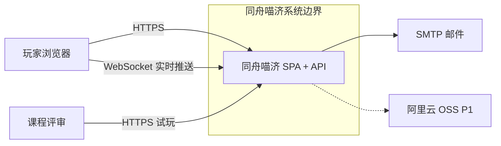
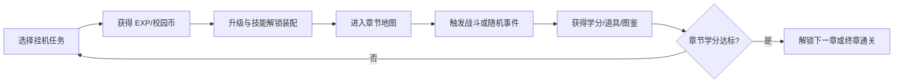
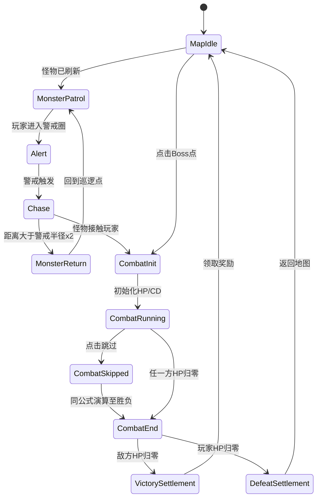
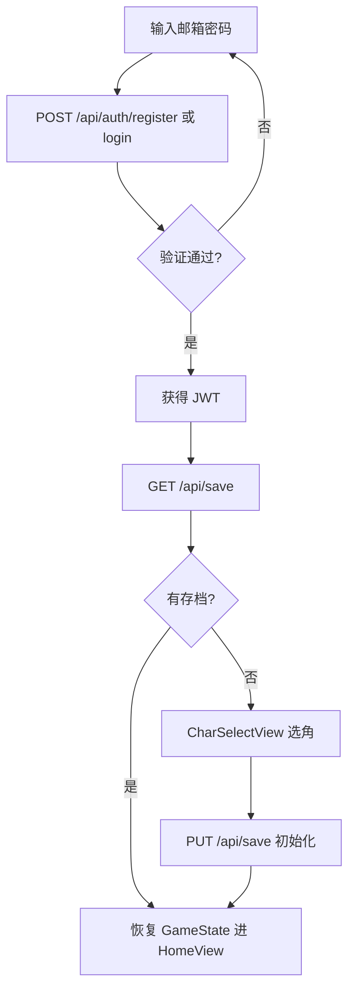
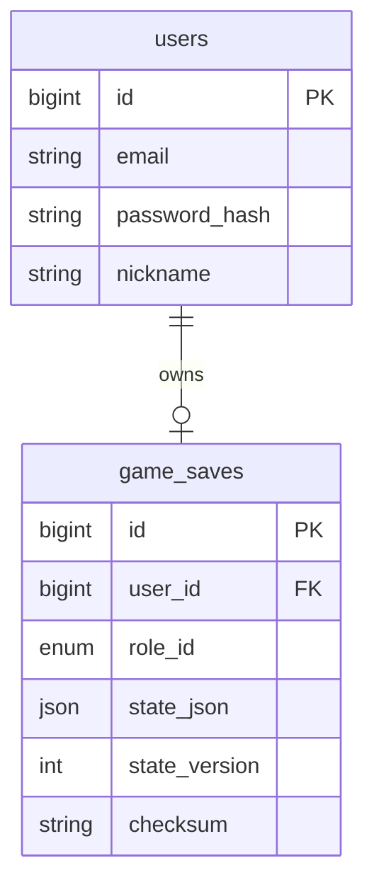
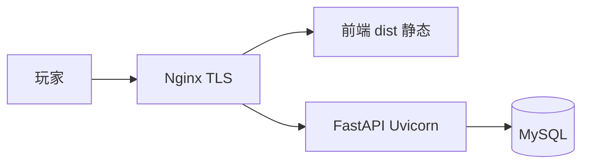

# 系统技术设计与开发方案

## 1. 文档信息

| 字段 | 内容 |
|------|------|
| 文档名称 | 系统技术设计与开发方案 |
| 项目名称 | 《同舟喵济》 |
| 版本号 | v1.0 |
| 作者 | 架构组 |
| 日期 | 2026-07-02 |
| PRD 引用 | [doc/tongji_academic_cat_gdd_初版.md](tongji_academic_cat_gdd_初版.md)（2026-07） |
| 状态 | PRD 对齐版 |

### 变更记录

| 版本 | 日期 | 变更内容 | 变更人 |
|------|------|----------|--------|
| v0.1 | 2026-07-01 | 初版草案（旧 PRD：多人像素 RPG） | 架构组 |
| v1.0 | 2026-07-02 | 按 GDD 初版全面重写：单人放置 RPG、自走战斗、五角色双形态 | 架构组 |

---

## 2. 需求复述与范围边界

### 2.1 需求复述

```
- 核心目标：3 周内完成可在线试玩的网页端单人轻量放置 RPG Demo（序章 + 四章主线均可通关）
- 团队规模：小团队（程序 + 策划 + 美术），3 周迭代节奏
- 开发模式：AI Agent 辅助策划与编程
- 用户角色：玩家（注册登录 → 选角 → 游戏）、课程评审（试玩体验）
- 关键功能：
  · 注册登录、五角色选角（莉娜/阿宇/知夏/江寻/老登，选定后不可更换）
  · 人形态/猫形态双形态切换
  · 主页插画 + 功能热点入口
  · 学习/实习挂机、离线收益（上限 8 小时）
  · 章节 2D 大地图探索（开雾、巡逻怪追击、脱战、地图内自走战斗）
  · 3 技能格装配（普攻固定 + 2 主动）、关卡解锁备选池
  · 随机事件、背包携带槽、校史图鉴、结局分支
  · 学分双轨（全游戏累计 / 章节内）、四章 Boss 通关
  · FastAPI + MySQL 云存档（唯一权威持久化）
- 核心玩法闭环：
  选角 → 挂机成长 → 章节大地图探索 → 地图即时自走战斗 → Boss 通关
  → 学分达标解锁下一章 → 终章 120 学分毕业
- 约束条件：3 周工期、阿里云 ECS 部署、总静态资源 < 1GB、核心资源仅 EXP/学分/校园币
- 技术栈：Vue 3 + Phaser 3 + Pinia + FastAPI + MySQL 8.x
```

### 2.2 核心用例清单

| 编号 | 用例名称 | P0/P1/P2 | GDD 引用 |
|------|----------|----------|----------|
| UC-01 | 玩家注册/登录 | P0 | §1.5 |
| UC-02 | 五角色选角（不可更换） | P0 | §4.2、§4.3 |
| UC-03 | 双形态切换（探索态） | P0 | §4.0.1 |
| UC-04 | 主页插画功能热点 | P0 | §9.1 |
| UC-05 | 学习/实习挂机 | P0 | §3.3 |
| UC-06 | 离线收益领取 | P0 | §3.4 |
| UC-07 | 成长页技能装配（3 格） | P0 | §4.4 |
| UC-08 | 章节大地图探索（开雾/移动） | P0 | §5.1 |
| UC-09 | 怪物警戒/追击/脱战 | P0 | §5.2 |
| UC-10 | 地图内完全自走战斗（1x/2x/跳过） | P0 | §5.2 |
| UC-11 | 随机事件（挂机 + 地图事件点） | P0 | §6 |
| UC-12 | 背包与携带槽 | P0 | §7 |
| UC-13 | 校史图鉴收集 | P0 | §3.2.1 |
| UC-14 | 学分推进与章节解锁 | P0 | §3.2.2、§8 |
| UC-15 | 四章 Boss 战与结局统计 | P0 | §2.3、§14 |
| UC-16 | MySQL 云存档读写 | P0 | §10.3、§14 |
| UC-17 | 移动浏览器兼容 | P1 | §1.4 |
| UC-18 | 配表热更新 API | P2 | §10.3 |

### 2.3 "本期不做"清单

| 编号 | 排除项 | 原因 |
|------|--------|------|
| EX-01 | 多人、聊天、排行、公会 | GDD §1.5 明确不做 |
| EX-02 | 抽卡、付费、赛季、活动日历 | GDD §1.5 明确不做 |
| EX-03 | 复杂装备词条、强化、合成、洗练 | GDD §7.2 背包简化 |
| EX-04 | 团队治疗、复活、吸血、团队 Buff | GDD §4.4 技能红线 |
| EX-05 | 辅助职业、转职、换角 | GDD §4.0 五选一全程固定 |
| EX-06 | ~~WebSocket 实时同步~~ | 已纳入：用于服务端推送随机事件/奖励通知，预留多人功能架构 |
| EX-07 | Redis / Celery | P0 无缓存/异步任务需求 |
| EX-08 | 音效/音乐系统 | 控制资源体积与工期 |
| EX-09 | 主动④⑤完整数值（Demo v1.0） | GDD §4.5 占位，不阻塞验收 |

---

## 3. 可用资源清单

### 3.1 服务器资源

| 环境 | 规格 | 数量 | 用途 |
|------|------|------|------|
| dev | 阿里云 ECS 2vCPU/4GB/40GB SSD | 1 | 开发联调 |
| staging | 阿里云 ECS 2vCPU/4GB/40GB SSD | 1 | 预发布验收 |
| prod | 阿里云 ECS 2vCPU/4GB/40GB SSD | 1 | 生产部署（单人低并发） |

### 3.2 数据库

| 资源 | 规格 | 说明 |
|------|------|------|
| MySQL 8.x | 与应用服务器同机部署 | dev/staging 环境 |
| MySQL 8.x | RDS for MySQL 8.x 2vCPU/4GB | prod 环境（可选独立实例） |

P0 不引入 Redis；JWT 无状态鉴权，存档直接读写 MySQL。

### 3.3 第三方服务

| 服务 | 用途 | 优先级 |
|------|------|--------|
| SMTP 邮件服务 | 注册验证码发送 | P0 |
| 阿里云 OSS | 静态资源托管（地图底图、角色立绘） | P1 |
| 阿里云 CDN | 静态资源加速 | P1 |

P0 阶段静态资源可随前端 `dist/` 由 Nginx 直接托管。

### 3.4 账号与权限

| 角色 | 权限范围 |
|------|----------|
| 程序 | ECS SSH、MySQL 读写、Git push |
| 策划/美术 | Git push（资源与配表分支）、OSS 读写（P1） |
| 测试 | staging 环境访问、Git read |
| PM | 全部环境 read、Git 管理 |

---

## 4. 总体架构

### 4.1 架构原则

| 原则 | 说明 |
|------|------|
| 客户端演算 | 战斗公式、地图状态机、事件结算在前端执行 |
| 服务端持久化 | MySQL 存储完整 `GameState`，后端校验关键进度防篡改 |
| 配置驱动 | 角色/技能/怪物/地图/事件以 JSON 配表加载 |
| 单人为主，实时推送辅助 | WebSocket 用于服务端推送随机事件/奖励通知，预留多人功能扩展能力 |

### 4.2 系统 Context



**Context 层要素**：
- 中心系统：《同舟喵济》Web 应用（Vue 3 + Phaser 3 + FastAPI）
- 外部用户：玩家、课程评审
- 外部依赖：SMTP（注册验证）、OSS（可选静态资源）
- 实时链路：WebSocket 用于服务端推送随机事件/奖励通知，预留多人功能扩展

### 4.3 Container 层

```mermaid
flowchart TB
  Browser[玩家浏览器]
  Nginx[Nginx 80/443]
  subgraph frontend [前端 SPA]
    Vue[Vue 3 UI 层]
    Phaser[Phaser 3 地图层]
    Sim[自走战斗演算器 TS]
    Pinia[Pinia GameState]
    WSClient[WebSocket 客户端]
  end
  subgraph backend [后端]
    FastAPI[FastAPI Uvicorn :8000]
    Auth[AuthService]
    Save[SaveService]
    Validator[ProgressValidator]
    WSHandler[WebSocket Handler]
    EventService[EventService]
    RewardService[RewardService]
  end
  MySQL[(MySQL 8.x :3306)]
  Browser --> Nginx
  Nginx --> Vue
  Vue --> Phaser
  Phaser --> Sim
  Sim --> Pinia
  Pinia -->|REST JWT| FastAPI
  WSClient -->|WebSocket| WSHandler
  FastAPI --> Auth
  FastAPI --> Save
  Save --> Validator
  Save --> MySQL
  Auth --> MySQL
  WSHandler --> EventService
  WSHandler --> RewardService
```



**Container 层要素**：
- 前端 SPA：Vue 3 页面 + Phaser 3 章节地图 + TypeScript 战斗演算 + WebSocket 客户端
- 后端 API：FastAPI REST + WebSocket Handler，Port 8000
- 数据库：MySQL 8.x，InnoDB，utf8mb4
- 网关：Nginx 反向代理 + 静态资源
- **WebSocket 容器**：用于服务端推送随机事件/奖励通知，预留多人功能扩展

### 4.4 Component 层

**后端组件**：

| 组件 | 职责 |
|------|------|
| Auth Module | 注册/登录/JWT 签发与校验 |
| Save Service | `GameState` 读写、乐观锁 version |
| ProgressValidator | 存档写入校验（学分、技能解锁、等级边界） |
| GameConfig API | 配表版本/hash 只读下发（P2 可选） |
| WebSocket Handler | 管理客户端连接，推送随机事件/奖励通知 |
| EventService | 随机事件触发逻辑，调用 WebSocket 推送 |
| RewardService | 奖励通知推送（离线收益、战斗胜利、成就解锁） |
| ConnectionManager | WebSocket 连接管理，预留多人房间功能 |
| SQLAlchemy ORM | 数据持久化 |

**前端组件**：

| 组件 | 职责 |
|------|------|
| CharSelectView | 五角色选角，展示双形态预览 |
| HomeView | 主页插画 + 功能热点（学习/实习/背包/图鉴/地图） |
| MapExploreScene | 章节大地图：开雾、移动、怪物 AI、战斗触发 |
| CombatOverlay | 地图内自走战斗 UI（血条、1x/2x/跳过） |
| IdlePanel | 挂机任务选择与收益展示 |
| GrowthView | 属性、3 技能格装配、备选池 |
| InventoryView | 背包、携带槽（学习/实习/探索） |
| ArchiveView | 校史图鉴 |
| EventModal | 随机事件选项弹窗 |
| combat/simulator | 战斗公式、技能 CD、Boss 阶段 |
| stores/game | Pinia 持有完整 GameState |

### 4.5 C4 Code 层

本期 MVP 不展开 Code 层。战斗演算器（`combat/simulator.ts`）与存档校验（`progress_validator.py`）若复杂度增长，可后续补充。

---

## 5. 技术栈选型

### 5.1 基础技术栈

| 层 | 选型 | 版本 | 选择理由 | 放弃理由（备选） |
|----|------|------|----------|------------------|
| 游戏渲染 | Phaser 3 | 3.80+ | 2D 章节大地图、镜头跟随、精灵动画、交互区域 | 纯 DOM（复杂追击/战斗表现难）、Three.js（3D 过重） |
| 前端 UI | Vue 3 + Vite | 3.4+ | 主页插画热点、弹窗、成长/背包/图鉴页面 | React（团队偏好 Vue） |
| 状态管理 | Pinia | 2.x | 持有 GDD §10.3 `GameState`，与 Phaser 解耦 | Vuex（已过时） |
| 前端样式 | Tailwind CSS | 3.4+ | 卡片式手游风 UI，圆角 ≤8px | 手写 SCSS（开发慢） |
| 战斗演算 | TypeScript 纯模块 | - | 自走战斗可同步/异步跑完，`跳过` 与 1x/2x 共用公式 | 后端权威战斗（延迟高、与 PRD 客户端演算不符） |
| 后端框架 | FastAPI | 0.110+ | 异步 REST、OpenAPI 文档、Pydantic 校验 | Django（过重） |
| 后端运行时 | Python | 3.10+ | 与存档校验逻辑、AI Agent 生态匹配 | Node.js（后端选型统一 Python） |
| 数据库 | MySQL | 8.x | JSON 字段存 `GameState`、关系型用户表 | MongoDB（事务与校验弱） |
| ORM | SQLAlchemy 2.0 | - | FastAPI 生态主流 | 原生 SQL（维护成本高） |
| 数据迁移 | Alembic | - | schema 版本化管理 | 手写 DDL（不可追溯） |

### 5.2 扩展技术栈

| 维度 | 选型 | 选择理由 | 放弃理由 |
|------|------|----------|----------|
| 日志 | Loguru | 结构化输出，零配置 | logging 标准库配置繁琐 |
| 监控 | Sentry | 错误追踪，免费 tier | ELK 过重 |
| API 文档 | FastAPI OpenAPI | 零配置 Swagger | 手写文档易过时 |
| 测试 | pytest + Vitest | 后端存档校验 + 前端战斗演算 | unittest 功能弱 |
| Lint | ruff + eslint | Python/TS 统一 CI | 无 |
| 实时通信 | FastAPI WebSocket | 原生支持，轻量，用于服务端推送 | Socket.IO（过重，需额外依赖） |

**明确不引入（P0）**：Redis、Celery。

### 5.3 脚手架

| 候选 | 选择 | 理由 |
|------|------|------|
| FastAPI 官方模板 | ✅ | 最简骨架 |
| fastapi-users | ✅ | 注册/登录/JWT |
| `npm create vite@latest` | ✅ | Vue 3 + TS 前端 |
| Phaser 3 TypeScript 模板 | ✅ | 游戏层入口 |

---

## 6. 目录结构与工程规范

### 6.1 后端目录结构

```
backend/
├── app/
│   ├── main.py                  # FastAPI 入口
│   ├── config.py                # 环境变量、数据库 URL
│   ├── database.py              # SQLAlchemy 引擎 + Session
│   ├── dependencies.py          # JWT 当前用户、DB Session
│   │
│   ├── models/
│   │   ├── user.py              # users 表
│   │   └── game_save.py         # game_saves 表
│   │
│   ├── schemas/
│   │   ├── auth.py
│   │   ├── game_state.py        # GameState Pydantic 镜像
│   │   └── common.py
│   │
│   ├── api/
│   │   ├── auth.py              # /api/auth/*
│   │   ├── save.py              # /api/save
│   │   └── config.py            # /api/config/*（P2）
│   │
│   ├── services/
│   │   ├── auth_service.py
│   │   ├── save_service.py
│   │   └── progress_validator.py
│   │
│   └── utils/
│       ├── security.py
│       └── errors.py
│
├── alembic/
├── tests/
├── requirements.txt
└── Dockerfile
```

**分层职责**：
- `api/`：HTTP 参数校验 + 调用 service
- `services/`：存档读写、进度校验、认证
- `schemas/game_state.py`：与 GDD §10.3 字段对齐的 Pydantic 模型

### 6.2 前端目录结构

```
frontend/
├── src/
│   ├── main.ts
│   ├── App.vue
│   │
│   ├── views/
│   │   ├── LoginView.vue
│   │   ├── RegisterView.vue
│   │   ├── CharSelectView.vue
│   │   ├── HomeView.vue           # 主页插画热点
│   │   ├── GrowthView.vue
│   │   ├── InventoryView.vue
│   │   ├── ArchiveView.vue
│   │   └── MapView.vue            # Phaser Canvas 容器
│   │
│   ├── components/
│   │   ├── ui/                    # 按钮、弹窗、进度条、资源栏
│   │   ├── EventModal.vue
│   │   ├── CombatSettlement.vue
│   │   └── OfflineRewardPanel.vue
│   │
│   ├── game/
│   │   ├── config.ts              # Phaser 配置
│   │   ├── scenes/
│   │   │   ├── BootScene.ts
│   │   │   ├── MapExploreScene.ts
│   │   │   └── CombatOverlayScene.ts
│   │   ├── systems/
│   │   │   ├── MapFogSystem.ts
│   │   │   ├── MonsterAISystem.ts
│   │   │   └── FormSwitchSystem.ts
│   │   ├── combat/
│   │   │   ├── simulator.ts       # 自走战斗主循环
│   │   │   ├── formulas.ts        # GDD §5.2 公式
│   │   │   ├── skill-runner.ts
│   │   │   └── types.ts
│   │   └── config/                # JSON 配表
│   │       ├── roles.json
│   │       ├── skills.json
│   │       ├── monsters.json
│   │       ├── chapters.json
│   │       ├── map-nodes.json
│   │       ├── events.json
│   │       ├── items.json
│   │       └── archives.json
│   │
│   ├── stores/
│   │   ├── user.ts                # 登录态
│   │   └── game.ts                # GameState
│   │
│   ├── api/
│   │   ├── client.ts
│   │   ├── auth.ts
│   │   └── save.ts
│   │
│   └── router/
│       └── index.ts
│
├── vite.config.ts
├── tailwind.config.js
└── package.json
```

### 6.3 命名规范

| 维度 | 规范 | 示例 |
|------|------|------|
| URL 路径 | kebab-case | `/api/auth/login`, `/api/save` |
| 数据库表/字段 | snake_case | `game_saves`, `state_json` |
| Python | snake_case / PascalCase | `save_service.py`, `ProgressValidator` |
| TypeScript 类 | PascalCase | `MapExploreScene`, `CombatSimulator` |
| 配表 ID | snake_case 或 GDD 约定 | `lina_s1`, `boss_ai_prof`, `m_delay` |
| Git 分支 | `feature/`, `fix/` | `feature/ch1-combat` |
| Git 提交 | conventional commits | `feat(combat): add auto-battle simulator` |

### 6.4 Git 分支策略

| 分支 | 用途 |
|------|------|
| `main` | 生产部署 |
| `dev` | 开发集成 |
| `feature/*` | 功能开发，PR 合并到 dev |

3 周小团队：功能分支单人负责，PR 至少 1 人 review。

---

## 7. 功能模块设计

### 7.1 模块清单与职责矩阵

| 模块 | P0 | 前端 | 后端 | GDD |
|------|----|------|------|-----|
| 注册登录 | ✅ | LoginView | AuthService | §1.5 |
| 五角色选角 | ✅ | CharSelectView | SaveService 初始化 | §4.2 |
| 双形态 | ✅ | FormSwitchSystem | — | §4.0.1 |
| 主页插画 | ✅ | HomeView | — | §9.1 |
| 挂机/离线 | ✅ | IdlePanel | SaveService 同步 | §3.3–3.4 |
| 技能装配 | ✅ | GrowthView | ProgressValidator | §4.4 |
| 地图探索 | ✅ | MapExploreScene | — | §5.1 |
| 怪物 AI | ✅ | MonsterAISystem | — | §5.2 |
| 自走战斗 | ✅ | combat/simulator | — | §5.2、附录 A |
| 随机事件 | ✅ | EventModal | EventService + WebSocket 推送 | §6 |
| 背包/携带槽 | ✅ | InventoryView | — | §7 |
| 校史图鉴 | ✅ | ArchiveView | — | §3.2.1 |
| 学分/章节 | ✅ | game store | ProgressValidator | §3.2.2、§8 |
| 云存档 | ✅ | api/save | SaveService | §10.3、§14 |
| WebSocket 推送 | ✅ | useWebSocket + RewardNotification | WebSocket Handler + RewardService | 新增 |

### 7.2 配置表清单

程序需加载的静态配表（首版放 `frontend/src/game/config/`，服务端 `ProgressValidator` 可读镜像）：

| 配表 | 关键字段 | GDD 引用 |
|------|----------|----------|
| RoleConfig | roleId, 初始四维, combatRole, 主属性 | §4.2 |
| SkillConfig | skillId, roleId, cooldown, multiplier, effect, unlockCondition | §4.5、§10.3 |
| MonsterConfig | monsterId, hp, atk, def, actionInterval, evasionRate, skills, rewards | §5.3、§10.3 |
| ChapterMapConfig | chapterId, mapId, 学分目标, 解锁条件 | §2.3、§8 |
| MapNodeConfig | nodeId, 类型, 坐标, 警戒半径, 首通/重复奖励 | §2.4、§5.1 |
| EventConfig | eventId, 触发场景, 选项, 奖励/后果 | §6 |
| ItemConfig | itemId, 分类, 效果, 来源 | §7 |
| ArchiveConfig | archiveId, 章节, 解锁条件 | §3.2.1 |
| RewardConfig | rewardId, sourceType, rewards | §10.3 |

Demo v1.0：`SkillConfig` 每角色实装普攻 + 主动①②③；④⑤ 仅保留 ID 占位。

### 7.3 GameState 字段规范

`state_json` 直接映射 GDD §10.3，核心结构如下：

```typescript
type GameState = {
  player: {
    name: string;
    roleId: "lina" | "ayu" | "zhixia" | "jiangxun" | "laodeng";
    currentForm: "human" | "cat";
    combatRole: "summon_spirit" | "dps_strike" | "dps_burst" | "dps_aoe" | "tank_heavy";
    level: number;
    exp: number;
    attrs: { knowledge: number; practice: number; insight: number; resilience: number };
    combatStats: { critRate: number; critDamage: number; evasionRate: number; accuracyRate: number };
    unlockedSkills: string[];
    equippedSkills: [string, string | null, string | null]; // [普攻, 格2, 格3]
  };
  resources: { credits: number; coins: number };
  idle: { task: "study" | "intern"; startedAt: number; lastClaimedAt: number };
  progress: {
    currentChapter: number;
    chapterCleared: boolean[];
    chapterCredits: number;
    clearedNodes: string[];
    seenEvents: string[];
    archives: string[];
  };
  map: {
    currentMapId: string;
    playerPosition: { x: number; y: number };
    formSwitchAllowed: boolean;
    revealedRegions: string[];
    completedNodes: string[];
    nodeCooldowns: Record<string, number>;
  };
  monsters: Record<string, {
    nodeId: string; monsterId: string;
    state: "patrol" | "alert" | "chase" | "combat" | "cleared" | "return";
    position: { x: number; y: number };
    patrolAnchor: { x: number; y: number };
    alertRadius: number; leashRadius: number;
    failCount: number;
  }>;
  combat: {
    state: "idle" | "init" | "running" | "skipped" | "end" | "settlement";
    speed: 1 | 2; canSkip: boolean; skipped: boolean;
    result?: "win" | "lose" | "flee";
    lastResult?: { monsterId: string; outcome: string; rewards: Reward[]; createdAt: number };
  };
  inventory: Record<string, number>;
  equipped: { study?: string; intern?: string; explore?: string };
};
```

| 字段 | Demo v1.0 | 说明 |
|------|-----------|------|
| `player.equippedSkills[2]` | 可 null | 技能②解锁前格 3 空置 |
| `unlockedSkills` 含 s4/s5 | 占位 | 有二/三章通关标记后才解锁 |
| `monsters` | 当前章 | 切换章节时按配表重置 |
| `progress.chapterCredits` | 必填 | 切章清零 |

**技能解锁伪代码**（与 GDD §10.3 一致）：

```typescript
function getUnlockedSkillIds(state: GameState): string[] {
  const { roleId } = state.player;
  const { chapterCleared, chapterCredits } = state.progress;
  const ids = [`${roleId}_basic`];
  if (state.progress.currentChapter >= 1) ids.push(`${roleId}_s1`);
  if (chapterCredits >= 8 || chapterCleared[0]) ids.push(`${roleId}_s2`);
  if (chapterCleared[0]) ids.push(`${roleId}_s3`);
  if (chapterCleared[1] && hasSkillConfig(`${roleId}_s4`)) ids.push(`${roleId}_s4`);
  if (chapterCleared[2] && hasSkillConfig(`${roleId}_s5`)) ids.push(`${roleId}_s5`);
  return [...new Set(ids)];
}
```

### 7.4 核心模块说明

#### 7.4.1 选角与双形态

- 选角在序章/游戏开始完成，`roleId` 写入存档后**不可更改**。
- 探索态：`currentForm` 可在 `human` / `cat` 间自由切换，不消耗资源。
- 进入战斗：`CombatInit` 强制 `currentForm = human`，战斗中禁止切回猫形态。
- 战斗结束回到地图，默认保持人形态，玩家可手动切猫形态。

#### 7.4.2 挂机与离线

| 任务 | 在线（每 5 秒） | 离线（上限 8h） |
|------|----------------|----------------|
| 学习 | EXP +10 | EXP |
| 实习 | EXP +6, 校园币 +8 | EXP + 校园币 |

- 挂机**不产生学分**；离线重进弹出「离线收获」面板。
- 挂机事件：在线每 10 分钟判定一次，离线最多累积 3 个。

#### 7.4.3 学分双轨

| 字段 | 存储 | 用途 |
|------|------|------|
| `resources.credits` | 全游戏累计 | UI「14/20」、跨章通关、终章 120 学分 |
| `progress.chapterCredits` | 当前章 | Boss 门 ≥12、技能② ≥8；**切章清零** |

里程碑：第一章 20、第二章 45、第三章 80、终章 120（均为累计学分）。

#### 7.4.4 技能系统

- **3 战斗格**：格 1 普攻固定；格 2–3 从已解锁主动池装配。
- **6 备选位**：1 普攻 + 5 主动；被动 2 个常驻生效，不占格、不可装配。
- 战斗内按行动条自动释放普攻；格 2–3 技能 CD 结束后按格位顺序自动释放。
- Demo v1.0：实装普攻 + ①②③；④⑤ 占位。

#### 7.4.5 地图探索

节点类型：普通区域、巡逻怪、资源点、事件点、解密点、Boss 点。

开雾规则：
- 初始仅入口区域可见，其余半透明遮罩。
- 进入新区域后揭示该区域及相邻通道。
- 怪物警戒圈等资源图标仅在区域揭示后显示。

#### 7.4.6 自走战斗

**属性公式**（GDD §5.2）：

```
最大生命 = 100 + 等级 × 18 + 韧性 × 12
攻击 = 等级 × 4 + 主属性 × 6
防御 = 韧性 × 2 + 实践 × 1
行动间隔 = max(0.8, 2.0 - 灵感 × 0.03)
基础伤害 = max(1, 攻击 - 防御 × 0.5)
技能伤害 = 基础伤害 × 技能倍率
```

**攻击流程**：闪避判定 → 伤害计算 → 暴击判定 → 减伤/护盾修正 → 扣 HP。

- 玩家可选 `1x`、`2x`、`跳过`；跳过与正常播放共用 `simulator.ts`，结果一致。
- 失败：20% EXP 安慰奖，不扣学分。
- 普通节点连续失败 3 次：下次同节点开场护盾 +50。
- Boss 连续失败 2 次：触发「回到图书馆查证」，EXP +30，下次 Boss 战开场护盾 +30%。
- Boss 战不读取携带道具效果。

#### 7.4.7 随机事件

- 地图事件点：靠近后必定触发 1 个事件。
- 每个事件 2–3 选项，奖励 EXP / 学分 / 校园币 / 道具 / 战斗 Buff。
- 选项结果写入 `Reward[]` 并更新 `GameState`。

#### 7.4.8 背包与携带槽

- 携带槽：学习 1 + 实习 1 + 探索 1（轻量，无复杂装备）。
- 道具分类：消耗品、纪念品、学术工具。
- 背包仅存数量 `{ itemId: count }`。

#### 7.4.9 校史图鉴与结局

- 存储于 `progress.archives`，**不进入** `resources`。
- 不影响战斗数值与 Boss 难度。
- 终局分支：<50% 标准、50–99% 记忆犹存、100% 完整校史（GDD §3.2.1）。

#### 7.4.10 存档同步策略

| 时机 | 动作 |
|------|------|
| 登录后 | GET `/api/save` 恢复 GameState |
| 选角确认 | PUT 初始化存档 |
| 战斗结束 / 章节通关 / 挂机领取 | PUT 全量 state_json |
| 定时（可选） | 每 60s PUT（debounce） |
| 写存档 | 携带 `state_version`，服务端乐观锁 |

### 7.5 流程图

#### 7.5.1 玩家主循环



#### 7.5.2 地图追击与战斗状态机



| 状态 ID | 说明 | 玩家可操作 |
|---------|------|-----------|
| MapIdle | 地图探索、开雾、拾取 | 移动、切换形态 |
| Alert / Chase | 怪物追击 | 移动、逃跑脱战 |
| CombatRunning | 自走战斗 | 1x、2x、跳过 |
| VictorySettlement | 极简结算页 | 继续探索 |

#### 7.5.3 注册登录与存档恢复



### 7.6 三周排期映射

| 阶段 | 目标 | 前后端分工 |
|------|------|-----------|
| 第 1 周 Day 1–5 | 第一章可玩闭环 | 脚手架、Auth、Save API、选角、挂机、地图骨架、基础战斗 |
| 第 2 周 Day 6–10 | 四章可通 | 四章配表、五角色技能、事件池、背包图鉴、存档校验 |
| 第 3 周 Day 11–15 | 打磨发布 | 数值平衡、UI 美化、QA、部署 |

详细日程对齐 GDD §13。

---

## 8. 数据模型设计

### 8.1 ER 概要



**不建表**：professions、online_sessions、battle_records、maps（地图逻辑在配表 + GameState）。

### 8.2 表结构 DDL

```sql
CREATE DATABASE IF NOT EXISTS tongzhou_meow
  DEFAULT CHARACTER SET utf8mb4
  DEFAULT COLLATE utf8mb4_unicode_ci;

USE tongzhou_meow;

-- 用户表
CREATE TABLE users (
  id            BIGINT UNSIGNED AUTO_INCREMENT PRIMARY KEY,
  email         VARCHAR(255) NOT NULL UNIQUE,
  password_hash VARCHAR(255) NOT NULL,
  nickname      VARCHAR(50) NOT NULL,
  is_active     TINYINT(1) NOT NULL DEFAULT 1,
  created_at    DATETIME NOT NULL DEFAULT CURRENT_TIMESTAMP,
  updated_at    DATETIME NOT NULL DEFAULT CURRENT_TIMESTAMP ON UPDATE CURRENT_TIMESTAMP,
  INDEX idx_email (email)
) ENGINE=InnoDB DEFAULT CHARSET=utf8mb4 COLLATE=utf8mb4_unicode_ci;

-- 游戏存档（一用户一档）
CREATE TABLE game_saves (
  id            BIGINT UNSIGNED AUTO_INCREMENT PRIMARY KEY,
  user_id       BIGINT UNSIGNED NOT NULL UNIQUE,
  role_id       ENUM('lina','ayu','zhixia','jiangxun','laodeng') NOT NULL,
  state_json    JSON NOT NULL COMMENT '完整 GameState',
  state_version INT NOT NULL DEFAULT 1 COMMENT '乐观锁版本',
  schema_version INT NOT NULL DEFAULT 1 COMMENT 'GameState schema 版本',
  checksum      VARCHAR(64) COMMENT 'state_json 摘要防篡改',
  created_at    DATETIME NOT NULL DEFAULT CURRENT_TIMESTAMP,
  updated_at    DATETIME NOT NULL DEFAULT CURRENT_TIMESTAMP ON UPDATE CURRENT_TIMESTAMP,
  CONSTRAINT fk_save_user FOREIGN KEY (user_id) REFERENCES users(id) ON DELETE CASCADE,
  INDEX idx_save_user (user_id)
) ENGINE=InnoDB DEFAULT CHARSET=utf8mb4 COLLATE=utf8mb4_unicode_ci;
```

### 8.3 配表存储策略

| 阶段 | 方案 |
|------|------|
| P0 | 配表打包在前端 `game/config/*.json`，随构建发布 |
| P2 | 可选 `game_config` 表或 OSS 托管，API 下发 version/hash |

后端 `ProgressValidator` 读取配表镜像（或硬编码边界常量）校验学分/等级增量。

---

## 9. 接口设计

### 9.1 RESTful 接口清单

| 方法 | 路径 | 入参 | 出参 | 鉴权 | 说明 |
|------|------|------|------|------|------|
| POST | `/api/auth/register` | email, password, nickname | user_id | 无 | 注册 |
| POST | `/api/auth/verify` | email, code | token | 无 | 邮箱验证 |
| POST | `/api/auth/login` | email, password | token, user | 无 | 登录 |
| POST | `/api/auth/refresh` | refresh_token | token | Cookie | 刷新令牌 |
| POST | `/api/auth/logout` | - | - | JWT | 登出 |
| GET | `/api/save` | - | GameState, state_version | JWT | 读取存档 |
| PUT | `/api/save` | GameState, state_version | state_version, checksum | JWT | 写入存档 |
| POST | `/api/event/resolve` | eventId, optionIndex | rewards | JWT | 事件结算 |
| GET | `/api/config/{type}` | - | config, version | JWT | 配表下发（P2） |
| GET | `/api/health` | - | status | 无 | 健康检查 |

**WebSocket 端点**：

| 协议 | 路径 | 鉴权 | 说明 |
|------|------|------|------|
| WebSocket | `/ws/game?token=<jwt>` | JWT Token | 实时推送连接，用于接收随机事件/奖励通知 |

**WebSocket 消息协议**：

客户端 → 服务端：
```json
{ "type": "ping" }
{ "type": "heartbeat" }
```

服务端 → 客户端：
```json
{ "type": "pong" }
{ "type": "heartbeat_ack" }
{ "type": "random_event", "data": { "eventId": "...", "name": "...", "options": [...] } }
{ "type": "reward", "data": { "source": "offline", "rewards": {...} } }
{ "type": "system", "data": { "message": "..." } }
```

**已删除**：`/api/battle/*`、`/api/maps/*/enter`、职业/任务/排行榜相关端点。

### 9.2 ProgressValidator 校验规则

| 规则 | 说明 |
|------|------|
| 学分单调 | `resources.credits` 只增不减；单次增量 ≤ 配表该来源上限 |
| 章节内学分 | `chapterCredits` 仅当前章有效；切章时客户端清零，服务端允许 |
| 技能解锁 | `unlockedSkills` 必须是 `getUnlockedSkillIds()` 子集 |
| 装配合法 | `equippedSkills` 格 1 为对应角色 `_basic`；格 2–3 在已解锁主动池中 |
| 等级/EXP | EXP 增量与来源（挂机/战斗/事件）粗略速率检查，异常拒绝写入 |
| 乐观锁 | `state_version` 不匹配返回 409，客户端重新 GET 合并 |

### 9.3 错误码总表

| 错误码 | HTTP | 说明 |
|--------|------|------|
| `AUTH_INVALID_CREDENTIALS` | 401 | 邮箱或密码错误 |
| `AUTH_EMAIL_EXISTS` | 409 | 邮箱已注册 |
| `AUTH_EMAIL_NOT_VERIFIED` | 403 | 邮箱未验证 |
| `AUTH_INVALID_TOKEN` | 401 | JWT 无效或过期 |
| `AUTH_REFRESH_EXPIRED` | 401 | 刷新令牌过期 |
| `SAVE_NOT_FOUND` | 404 | 无存档（新用户） |
| `SAVE_VERSION_MISMATCH` | 409 | 乐观锁冲突 |
| `SAVE_VALIDATION_FAILED` | 400 | ProgressValidator 拒绝 |
| `SAVE_ROLE_LOCKED` | 403 | 试图修改已锁定 roleId |
| `RATE_LIMIT_EXCEEDED` | 429 | 请求过于频繁 |
| `INTERNAL_ERROR` | 500 | 服务器内部错误 |

---

## 10. 安全设计

### 10.1 认证方案

JWT + 刷新令牌，生命周期与旧方案一致：

```
登录/注册 → access_token（15min）+ refresh_token（7天, httpOnly cookie）
API 请求 → Authorization: Bearer <access_token>
WebSocket → ws://host/ws/game?token=<access_token>（URL 参数传递）
登出 → refresh_token 失效 + 前端清 token
```

**WebSocket 认证流程**：
1. 客户端在 WebSocket 连接时通过 URL 参数传递 `token`
2. 服务端在 `ws.py` 中解析并验证 JWT
3. 验证失败则关闭连接（code=4001）
4. 验证成功则建立连接并维护用户会话

### 10.2 授权模型

| 角色 | 权限 |
|------|------|
| 玩家 | 仅读写自己的 `game_saves` |
| 评审 | 只读试玩账号（可选） |

FastAPI Depends 校验 `user_id` 与存档 ownership。

### 10.3 存档防篡改

| 措施 | 说明 |
|------|------|
| ProgressValidator | 服务端校验学分/技能/等级边界 |
| checksum | 可选 HMAC(state_json) 存储，检测异常篡改 |
| roleId 锁定 | 首次写入后禁止变更 |

### 10.4 传输与输入安全

| 维度 | 措施 |
|------|------|
| HTTPS | Nginx TLS 1.2+ |
| 密码 | bcrypt cost=12 |
| SQL 注入 | SQLAlchemy 参数化 |
| XSS | Vue 模板转义 + CSP |
| 输入校验 | Pydantic schema 校验 GameState 结构 |

---

## 11. 非功能需求

### 11.1 性能

| 指标 | 目标值 | 测量方式 |
|------|--------|----------|
| API P95 | < 200ms | Sentry / 日志 |
| 存档 PUT P95 | < 300ms | 集成测试 |
| 战斗跳过演算 | < 100ms | Vitest benchmark |
| 地图帧率 | ≥ 30fps（目标 60fps） | Phaser stats |
| 首屏加载 | < 3s | Lighthouse |
| 静态资源总量 | < 1GB | 构建产物检查 |

### 11.2 可用性

| 指标 | 目标 |
|------|------|
| Demo 期间可用率 | 99% |
| 故障恢复 | < 5min 手动重启 |

### 11.3 可观测性

| 维度 | 工具 |
|------|------|
| 日志 | Loguru → stdout |
| 错误 | Sentry |
| 业务 | 注册数、章节通关数、存档写入次数 |

### 11.4 可维护性

| 指标 | 目标 |
|------|------|
| 战斗演算单元测试覆盖率 | > 80% |
| 存档校验测试 | 覆盖主要作弊场景 |
| API 文档 | FastAPI OpenAPI 100% |

### 11.5 兼容性

| 维度 | 目标 |
|------|------|
| 浏览器 P0 | Chrome/Firefox/Edge/Safari 最近两个大版本 |
| 分辨率 P0 | 1280×720 及以上 |
| 移动浏览器 | P1 基本可玩 |

### 11.6 成本

| 资源 | 月预估 |
|------|--------|
| ECS 2vCPU/4GB | ¥100 |
| RDS MySQL（可选） | ¥150 |
| 域名 + SSL | ¥10 |
| **合计** | **¥120–260/月** |

---

## 12. 部署架构与运维方案

### 12.1 环境分层

| 环境 | 用途 | 部署 |
|------|------|------|
| dev | 联调 | push dev 分支 |
| staging | 验收 | PR 合并 staging |
| prod | 试玩 | 手动触发 |

### 12.2 部署拓扑



单机 ECS 2vCPU/4GB 足够：Nginx + Uvicorn（2 workers）+ MySQL 同机或 RDS。

### 12.3 发布与回滚

1. CI 构建 Docker 镜像
2. staging 验收
3. prod：`docker-compose pull && docker-compose up -d`
4. 健康检查 `GET /api/health`
5. 回滚：切回上一镜像 tag

---

## 13. 多端适配策略

### 13.1 断点

| 断点 | 宽度 | 优先级 |
|------|------|--------|
| lg | > 1024px | P0 PC |
| md | 768–1024px | P1 平板 |
| sm | < 768px | P1 手机 |

### 13.2 策略

- P0：PC 浏览器，Phaser 画布固定比例，Vue UI 自适应宽度。
- P1：移动浏览器 Canvas 等比缩放 + 虚拟摇杆（GDD §1.4 兼容移动浏览器）。

---

## 14. 前后端联调测试方案

### 14.1 测试策略

| 层 | 工具 | 覆盖目标 |
|----|------|----------|
| 单元测试 | Vitest | `combat/simulator.ts`：公式、暴击/闪避、Boss 三阶段 |
| 单元测试 | Vitest | `getUnlockedSkillIds`、学分双轨逻辑 |
| 单元测试 | pytest | `ProgressValidator` 作弊场景 |
| 集成测试 | pytest + httpx | 注册 → 登录 → PUT save → GET save |
| E2E | Playwright | 选角 → 第一章 Boss 通关 → 刷新恢复存档 |
| 数值对照 | Vitest | Lv.6 五角色 vs AI 陆教授（GDD 附录 A §15.1） |

### 14.2 验收标准（对齐 GDD §14）

| 编号 | 验收项 | 标准 |
|------|--------|------|
| AC-01 | 五角色选角 | 五选一，选定后不可换角，可独立通四章 |
| AC-02 | 双形态 | 探索可切换；战斗强制人形态 |
| AC-03 | 3 技能格 | 格 1 普攻固定；格 2–3 装配；被动不占格 |
| AC-04 | Demo 技能 | 普攻 + ①②③ 实装；④⑤ 占位不阻塞 |
| AC-05 | 自走战斗 | 1x/2x/跳过结果一致；无手动放技能 |
| AC-06 | 地图追击 | 警戒/追击/脱战/回巡逻点按状态机 |
| AC-07 | 挂机离线 | 学习/实习在线离线均有收益；离线 ≤8h |
| AC-08 | 学分 | 累计/章节内双轨；Boss 门 12、技能② 8 |
| AC-09 | 四章通关 | 20/45/80/120 学分里程碑 |
| AC-10 | 图鉴结局 | 收集率影响结局分支，不影响战斗 |
| AC-11 | 云存档 | 刷新页面后进度不丢 |
| AC-12 | 资源边界 | 仅 EXP/学分/校园币三种核心资源 |

---

## 15. 风险与应对

### 15.1 技术风险

| 编号 | 风险 | 概率 | 影响 | 应对 |
|------|------|------|------|------|
| TR-01 | 自走战斗数值与 GDD 附录 A 偏差 | 中 | 高 | simulator 单元测试对照 Lv.6 Boss 表；策划热调 JSON |
| TR-02 | Phaser 大地图 + 多怪物性能 | 中 | 中 | 离屏裁剪；警戒圈外怪物简化更新 |
| TR-03 | 存档乐观锁冲突 | 低 | 中 | 客户端 merge 策略；关键节点才 PUT |
| TR-04 | 五角色 Boss 平衡（莉娜 Lv.8+） | 中 | 中 | 失败补偿机制；事件 Buff |
| TR-05 | 3 周工期溢出 | 中 | 高 | 二至四章地图可先换色复用组件；④⑤ 占位 |

### 15.2 进度风险

| 编号 | 风险 | 应对 |
|------|------|------|
| PR-01 | 第 1 周未打通第一章 | 砍 P2 配表 API；美术占位图 |
| PR-02 | 美术资产延迟 | 扁平图标 + 灰盒地图先跑通 |

---

## 16. 设计约束与取舍说明

### 16.1 约束清单

| 编号 | 约束 | 来源 |
|------|------|------|
| C-01 | 3 周交付 Demo | GDD §1.5、§13 |
| C-02 | 单人网页放置 RPG | GDD §1.2 |
| C-03 | 三种核心资源 | GDD §3.2 |
| C-04 | FastAPI + MySQL 权威存档 | 项目决策 |
| C-05 | 总资源 < 1GB | GDD §11.4 |
| C-06 | Demo 技能 ①②③ | GDD §4.5 |

### 16.2 关键 ADR

| 编号 | 决策 | 理由 |
|------|------|------|
| ADR-001 | 自走战斗（非回合制手动） | GDD §5.2；玩家仅 1x/2x/跳过 |
| ADR-002 | 客户端演算 + 服务端存档校验 | 低延迟战斗；MySQL 防刷进度 |
| ADR-003 | 不引入 Redis | P0 无缓存/排行榜需求 |
| ADR-004 | Vue + Phaser 双层 | UI 页面用 Vue，地图/战斗用 Phaser |
| ADR-005 | 配表 JSON 打包前端 | 3 周工期；后端只校验边界 |
| ADR-006 | 一用户一档 game_saves | 单人单角色通关，简化 schema |

---

## 17. 附录

### 17.1 术语表

| 术语 | 定义 |
|------|------|
| 学术喵 | 玩家可选的五位主角统称 |
| 同舟喵济 | 游戏正式名称 |
| 人形态 / 猫形态 | 战斗表现 / 探索表现的双形态 |
| roleId | 角色标识：lina/ayu/zhixia/jiangxun/laodeng |
| 学分（累计） | `resources.credits`，全游戏只增不减 |
| 章节内学分 | `progress.chapterCredits`，切章清零 |
| 校史图鉴 | 特殊收集条目，影响结局，非资源 |
| 完全自走战斗 | 普攻与技能按 CD 自动释放，玩家不手动操作 |
| AI 陆教授 | 第一章 Boss，`boss_ai_prof` |
| GameState | 完整游戏状态 JSON，存档核心 |
| 携带槽 | 学习/实习/探索各 1 个道具槽 |

### 17.2 ADR 记录表

| ADR | 标题 | 状态 | 日期 |
|-----|------|------|------|
| ADR-001 | 战斗系统选择自走演算 | Accepted | 2026-07-02 |
| ADR-002 | 客户端演算 + 服务端存档校验 | Accepted | 2026-07-02 |
| ADR-003 | P0 不引入 Redis | Accepted | 2026-07-02 |
| ADR-004 | Vue + Phaser 双层架构 | Accepted | 2026-07-02 |
| ADR-005 | 配表 JSON 打包前端 | Accepted | 2026-07-02 |
| ADR-006 | 一用户一档存档 | Accepted | 2026-07-02 |

### 17.3 变更日志

| 日期 | 变更内容 |
|------|----------|
| 2026-07-01 | v0.1 初版（旧 PRD） |
| 2026-07-02 | v1.0 按 GDD 初版全面重写 |

---

## 附录 A：验收清单自检

| # | 验收项 | 通过 |
|---|--------|------|
| 1 | PRD 引用指向 GDD 初版 | ✅ |
| 2 | 五角色、双形态、3 技能格覆盖 | ✅ |
| 3 | 自走战斗 + 地图状态机 | ✅ |
| 4 | 学分双轨、三种资源 | ✅ |
| 5 | GameState 与 GDD §10.3 对齐 | ✅ |
| 6 | MySQL 存档 DDL + REST API | ✅ |
| 7 | WebSocket 推送随机事件/奖励通知 | ✅ |
| 8 | 三周排期与 GDD §13 对齐 | ✅ |
| 9 | 验收标准映射 GDD §14 | ✅ |
| 10 | 旧 PRD 术语已清除 | ✅ |

## 附录 B：反模式自查

| # | 反模式 | 结果 |
|---|--------|------|
| 1 | 引入 PRD 未要求中间件（Redis/WS） | ✅ P0 未依赖 |
| 2 | 同一概念多种叫法 | ✅ 术语表锁定 |
| 3 | 架构与 PRD 矛盾 | ✅ 单人自走，非多人回合 |
| 4 | 接口无对应数据表 | ✅ save/auth 有表 |
| 5 | 安全只有「JWT」无生命周期 | ✅ §10.1 完整流程 |
| 6 | 非功能无测量方式 | ✅ §11 含指标 |

---

*文档结束*
